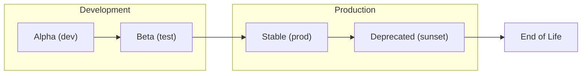

# API Versioning Strategy

API versioning approach for CloudForge.

---

## 🎯 Versioning Strategy

We use **URL path versioning**:
```
https://api.cloudforge.io/v1/users
https://api.cloudforge.io/v2/users
```

### Why URL Versioning?
| Method | Pros | Cons |
|--------|------|------|
| **URL path** ✅ | Clear, cacheable, easy routing | URL changes |
| Header | Clean URLs | Hard to test, cache issues |
| Query param | Simple | Can be missed |

---

## 📋 Version Lifecycle



| Status | Description | Support |
|--------|-------------|---------|
| **Alpha** | Development, breaking changes | None |
| **Beta** | Testing, may change | Limited |
| **Stable** | Production ready | Full |
| **Deprecated** | Sunset announced | Minimal |

---

## 🔄 Breaking vs Non-Breaking Changes

### Non-Breaking (No version bump)
- ✅ Adding new endpoints
- ✅ Adding optional fields to response
- ✅ Adding optional request parameters
- ✅ Bug fixes

### Breaking (New version required)
- ❌ Removing endpoints
- ❌ Removing response fields
- ❌ Changing field types
- ❌ Changing required parameters
- ❌ Changing authentication

---

## 🛠️ Implementation

### Controller
```java
@RestController
@RequestMapping("/api/v1/users")
public class UserControllerV1 {
    // v1 implementation
}

@RestController
@RequestMapping("/api/v2/users")
public class UserControllerV2 {
    // v2 implementation (extended response)
}
```

### Routing
```yaml
# Ingress
rules:
  - path: /api/v1/*
    backend: api-gateway-v1
  - path: /api/v2/*
    backend: api-gateway-v2
```

---

## 📢 Deprecation Process

1. **Announce** - 6 months notice via email, docs, response headers
2. **Add headers** - `Deprecation: true`, `Sunset: <date>`
3. **Monitor** - Track v1 usage
4. **Migrate** - Help customers move to v2
5. **Remove** - After sunset date

### Deprecation Headers
```http
HTTP/1.1 200 OK
Deprecation: true
Sunset: Sat, 01 Jan 2027 00:00:00 GMT
Link: <https://docs.cloudforge.io/v2>; rel="successor-version"
```

---

## 📚 Related Docs

- [API Reference](api-reference.md)
- [Code Style Guide](code-style-guide.md)
