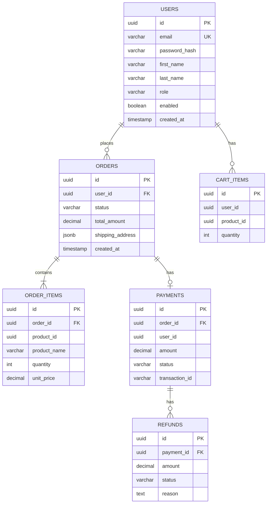

# Database Schema

Database schemas for PostgreSQL and MongoDB used in CloudForge.

---

## 🐘 PostgreSQL Schemas

### User Service Database

```sql
-- Users table
CREATE TABLE users (
    id UUID PRIMARY KEY DEFAULT gen_random_uuid(),
    email VARCHAR(255) UNIQUE NOT NULL,
    password_hash VARCHAR(255) NOT NULL,
    first_name VARCHAR(100),
    last_name VARCHAR(100),
    role VARCHAR(50) DEFAULT 'USER',
    enabled BOOLEAN DEFAULT true,
    created_at TIMESTAMP DEFAULT CURRENT_TIMESTAMP,
    updated_at TIMESTAMP DEFAULT CURRENT_TIMESTAMP
);

CREATE INDEX idx_users_email ON users(email);
```

### Order Service Database

```sql
-- Orders table
CREATE TABLE orders (
    id UUID PRIMARY KEY DEFAULT gen_random_uuid(),
    user_id UUID NOT NULL,
    status VARCHAR(50) DEFAULT 'PENDING',
    total_amount DECIMAL(10,2) NOT NULL,
    shipping_address JSONB,
    created_at TIMESTAMP DEFAULT CURRENT_TIMESTAMP,
    updated_at TIMESTAMP DEFAULT CURRENT_TIMESTAMP
);

-- Order items
CREATE TABLE order_items (
    id UUID PRIMARY KEY DEFAULT gen_random_uuid(),
    order_id UUID REFERENCES orders(id),
    product_id UUID NOT NULL,
    product_name VARCHAR(255),
    quantity INTEGER NOT NULL,
    unit_price DECIMAL(10,2) NOT NULL,
    created_at TIMESTAMP DEFAULT CURRENT_TIMESTAMP
);

-- Cart
CREATE TABLE cart_items (
    id UUID PRIMARY KEY DEFAULT gen_random_uuid(),
    user_id UUID NOT NULL,
    product_id UUID NOT NULL,
    quantity INTEGER NOT NULL,
    created_at TIMESTAMP DEFAULT CURRENT_TIMESTAMP,
    UNIQUE(user_id, product_id)
);

CREATE INDEX idx_orders_user_id ON orders(user_id);
CREATE INDEX idx_order_items_order_id ON order_items(order_id);
```

### Payment Service Database

```sql
-- Payments table
CREATE TABLE payments (
    id UUID PRIMARY KEY DEFAULT gen_random_uuid(),
    order_id UUID NOT NULL,
    user_id UUID NOT NULL,
    amount DECIMAL(10,2) NOT NULL,
    status VARCHAR(50) DEFAULT 'PENDING',
    payment_method VARCHAR(50),
    transaction_id VARCHAR(255),
    idempotency_key VARCHAR(255) UNIQUE,
    created_at TIMESTAMP DEFAULT CURRENT_TIMESTAMP,
    updated_at TIMESTAMP DEFAULT CURRENT_TIMESTAMP
);

-- Refunds table
CREATE TABLE refunds (
    id UUID PRIMARY KEY DEFAULT gen_random_uuid(),
    payment_id UUID REFERENCES payments(id),
    amount DECIMAL(10,2) NOT NULL,
    status VARCHAR(50) DEFAULT 'PENDING',
    reason TEXT,
    created_at TIMESTAMP DEFAULT CURRENT_TIMESTAMP
);

CREATE INDEX idx_payments_order_id ON payments(order_id);
CREATE INDEX idx_payments_idempotency ON payments(idempotency_key);
```

---

## 🍃 MongoDB Schemas

### Product Service Collections

```javascript
// products collection
{
  _id: ObjectId,
  name: String,
  description: String,
  price: Decimal128,
  stock: Number,
  categoryId: ObjectId,
  images: [String],
  attributes: {
    color: String,
    size: String,
    // dynamic attributes
  },
  tags: [String],
  rating: {
    average: Number,
    count: Number
  },
  isActive: Boolean,
  createdAt: Date,
  updatedAt: Date
}

// categories collection
{
  _id: ObjectId,
  name: String,
  slug: String,
  description: String,
  parentId: ObjectId,  // for nested categories
  image: String,
  isActive: Boolean,
  createdAt: Date
}

// Indexes
db.products.createIndex({ name: "text", description: "text" });
db.products.createIndex({ categoryId: 1 });
db.products.createIndex({ price: 1 });
db.products.createIndex({ "tags": 1 });
```

---

## 📊 ER Diagram



---

## 🔄 Migrations

Using Flyway for PostgreSQL migrations:

```
services/<service>/src/main/resources/db/migration/
├── V1__initial_schema.sql
├── V2__add_indexes.sql
└── V3__add_audit_columns.sql
```

Run migrations:
```bash
./mvnw flyway:migrate
```
