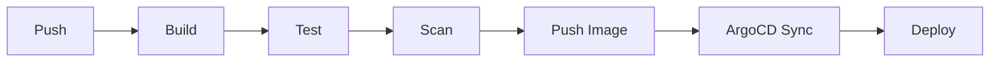

# DevOps & CI/CD Documentation

CI/CD pipelines, GitOps, and automation documentation.

---

## 📚 Documents

| Document | Description |
|----------|-------------|
| [DevOps Toolchain](devops-toolchain.md) | Complete toolchain overview (25+ tools) |
| [CI/CD Pipeline](ci-cd-pipeline.md) | GitHub Actions workflows |
| [GitOps](gitops.md) | ArgoCD configuration |

---

## 🔄 Pipeline Flow

---

## 🛠️ Tools

| Category | Tools |
|----------|-------|
| CI/CD | GitHub Actions |
| GitOps | ArgoCD |
| Registry | Docker Hub / ACR |
| Scanning | Trivy, SonarQube |
| Notifications | Slack |

---

## 📖 Related Docs

- [Phase 3: CI Pipeline](../phases/phase-3-ci-pipeline.md)
- [Phase 4: Kubernetes](../phases/phase-4-kubernetes.md)
