# CI/CD Pipeline Guide

GitHub Actions workflows for CloudForge.

---

## 🏗️ Pipeline Architecture

```mermaid
flowchart LR
    subgraph "CI - Build & Test"
        A[📥 Checkout] --> B[☕ Setup Java]
        B --> C[📦 Maven Build]
        C --> D[🧪 Unit Tests]
        D --> E[📊 SonarQube]
    end
    
    subgraph "CI - Security"
        E --> F[🐳 Build Image]
        F --> G[🛡️ Trivy Scan]
        G --> H{Pass?}
        H -->|Yes| I[📤 Push Image]
        H -->|No| J[❌ Fail]
    end
    
    subgraph "CD - Deploy"
        I --> K[📝 Update Helm]
        K --> L[🔄 ArgoCD Sync]
        L --> M[☸️ Deploy]
    end
    
    subgraph "Post-Deploy"
        M --> N[🔐 ZAP Scan]
        N --> O[✅ Slack]
    end
```



---

## 📁 Workflow Files

```
.github/workflows/
├── ci.yml              # Main CI pipeline
├── cd.yml              # Deployment pipeline
└── security-scan.yml   # Scheduled security scan
```

---

## 🔧 CI Workflow (ci.yml)

```yaml
name: CI Pipeline

on:
  push:
    branches: [main, develop]
  pull_request:
    branches: [main]

jobs:
  build:
    runs-on: ubuntu-latest
    
    steps:
      - uses: actions/checkout@v4
      
      - name: Setup Java
        uses: actions/setup-java@v4
        with:
          java-version: '17'
          distribution: 'temurin'
          
      - name: Build & Test
        run: ./mvnw verify
        
      - name: SonarQube Scan
        uses: sonarqube/sonarcloud-github-action@master
        env:
          SONAR_TOKEN: ${{ secrets.SONAR_TOKEN }}
          
  docker:
    needs: build
    runs-on: ubuntu-latest
    
    steps:
      - name: Build Docker Image
        run: docker build -t ${{ env.IMAGE_NAME }}:${{ github.sha }} .
        
      - name: Trivy Scan
        uses: aquasecurity/trivy-action@master
        with:
          image-ref: ${{ env.IMAGE_NAME }}:${{ github.sha }}
          exit-code: '1'
          severity: 'CRITICAL,HIGH'
          
      - name: Push to Docker Hub
        run: |
          docker login -u ${{ secrets.DOCKER_USER }} -p ${{ secrets.DOCKER_TOKEN }}
          docker push ${{ env.IMAGE_NAME }}:${{ github.sha }}
```

---

## 🚀 CD Workflow (cd.yml)

```yaml
name: CD Pipeline

on:
  workflow_run:
    workflows: ["CI Pipeline"]
    types: [completed]
    branches: [main]

jobs:
  deploy:
    if: ${{ github.event.workflow_run.conclusion == 'success' }}
    runs-on: ubuntu-latest
    
    steps:
      - name: Update Helm Values
        run: |
          # Update image tag in values.yaml
          
      - name: Trigger ArgoCD Sync
        run: |
          argocd app sync cloudforge
          
      - name: Notify Slack
        uses: 8398a7/action-slack@v3
        with:
          status: ${{ job.status }}
          webhook_url: ${{ secrets.SLACK_WEBHOOK }}
```

---

## 🛡️ Security Scan (security-scan.yml)

```yaml
name: Security Scan

on:
  schedule:
    - cron: '0 0 * * 0'  # Weekly
  workflow_dispatch:

jobs:
  zap-scan:
    runs-on: ubuntu-latest
    
    steps:
      - name: OWASP ZAP Scan
        uses: zaproxy/action-baseline@v0.9.0
        with:
          target: 'https://dev-api.cloudforge.io'
```

---

## 🔑 Required Secrets

| Secret | Purpose |
|--------|---------|
| `DOCKER_USER` | Docker Hub username |
| `DOCKER_TOKEN` | Docker Hub access token |
| `SONAR_TOKEN` | SonarCloud token |
| `SLACK_WEBHOOK` | Slack webhook URL |
| `AZURE_CREDENTIALS` | Azure service principal |

---

## 📚 Next Steps

- [GitOps](gitops.md) - ArgoCD setup
- [Monitoring](monitoring.md) - Pipeline metrics
