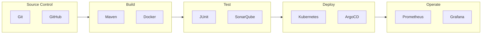
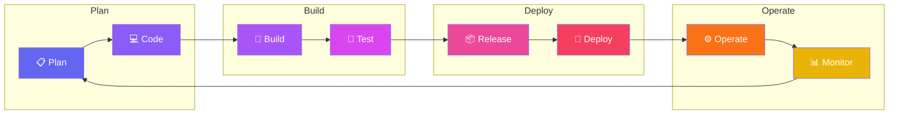
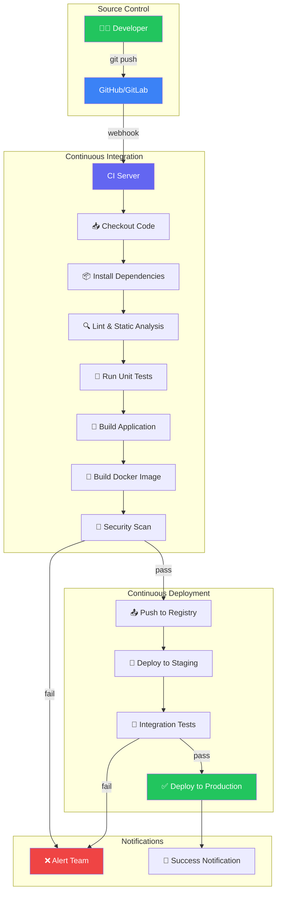
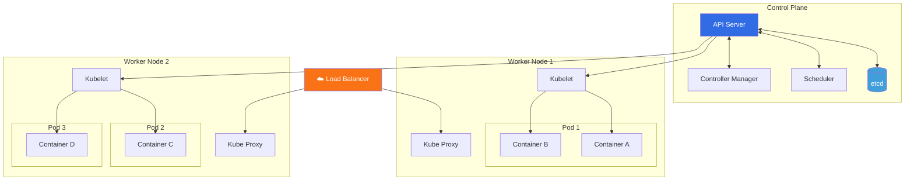
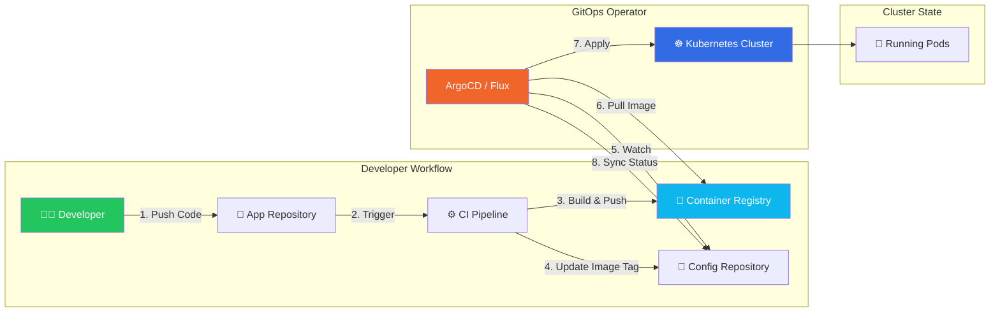
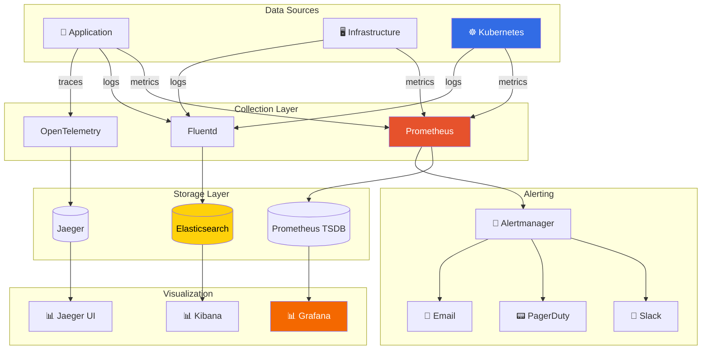
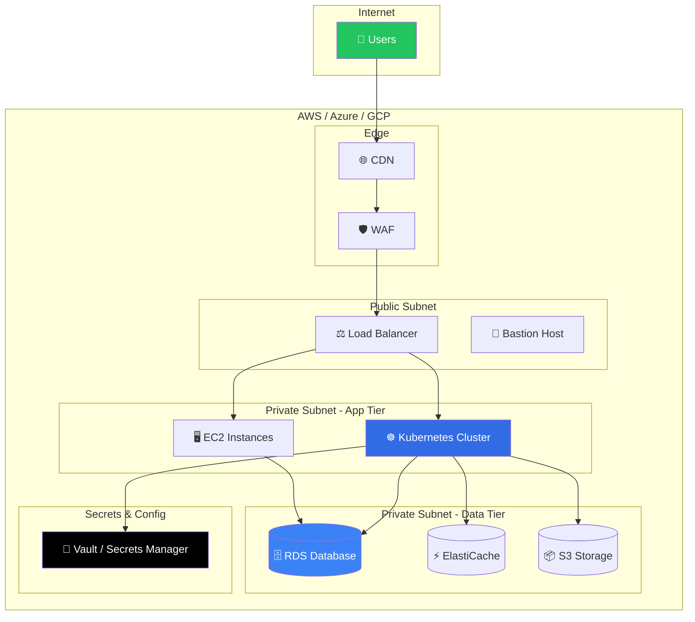

# 🛠️ Complete DevOps Toolchain Reference

> A comprehensive guide to DevOps tools for building production-grade infrastructure and CI/CD pipelines.

---

## 📋 Toolchain Overview



---

## 🔄 DevOps Lifecycle



---

## 🔁 CI/CD Pipeline Flow



---

## ☸️ Kubernetes Architecture



---

## 🔄 GitOps Workflow



---

## 📊 Monitoring & Observability Stack



---

## ☁️ Cloud Infrastructure Architecture



---

## 1️⃣ Version Control & Collaboration

| Tool | Purpose | Free Tier? |
|------|---------|------------|
| **Git** | Distributed version control | ✅ Yes |
| **GitHub** | Code hosting, Actions CI/CD | ✅ Yes |
| **GitLab** | Complete DevOps platform | ✅ Yes |
| **Bitbucket** | Git hosting (Atlassian) | ✅ Yes |

---

## 2️⃣ CI/CD (Continuous Integration / Continuous Deployment)

| Tool | Purpose | Free Tier? |
|------|---------|------------|
| **Jenkins** | Self-hosted automation server | ✅ Open source |
| **GitHub Actions** | Built-in CI/CD for GitHub | ✅ 2000 mins/month |
| **GitLab CI/CD** | Built-in CI/CD for GitLab | ✅ 400 mins/month |
| **Azure DevOps** | Microsoft's DevOps suite | ✅ 1800 mins/month |
| **CircleCI** | Cloud-native CI/CD | ✅ Limited |
| **Travis CI** | Simple CI for open source | ✅ Open source |
| **ArgoCD** | GitOps continuous delivery | ✅ Open source |
| **Flux** | GitOps for Kubernetes | ✅ Open source |

---

## 3️⃣ Containerization & Orchestration

| Tool | Purpose | Free Tier? |
|------|---------|------------|
| **Docker** | Container runtime | ✅ Yes |
| **Docker Compose** | Multi-container orchestration | ✅ Yes |
| **Kubernetes** | Container orchestration | ✅ Open source |
| **Minikube** | Local Kubernetes cluster | ✅ Open source |
| **K3s** | Lightweight Kubernetes | ✅ Open source |
| **Rancher** | Kubernetes management | ✅ Open source |
| **Podman** | Daemonless containers | ✅ Open source |
| **Helm** | Kubernetes package manager | ✅ Open source |

---

## 4️⃣ Infrastructure as Code (IaC)

| Tool | Purpose | Free Tier? |
|------|---------|------------|
| **Terraform** | Multi-cloud provisioning | ✅ Open source |
| **Pulumi** | IaC with programming languages | ✅ Individual tier |
| **AWS CloudFormation** | AWS-native IaC | ✅ Yes (AWS) |
| **Azure ARM/Bicep** | Azure-native IaC | ✅ Yes (Azure) |
| **Ansible** | Configuration management | ✅ Open source |
| **Chef** | Configuration management | ✅ Open source |
| **Puppet** | Configuration management | ✅ Open source |
| **Vagrant** | VM provisioning (local dev) | ✅ Open source |

---

## 5️⃣ Cloud Platforms

| Provider | Key Services | Free Tier? |
|----------|-------------|------------|
| **AWS** | EC2, EKS, RDS, S3, Lambda | ✅ 12-month free tier |
| **Azure** | VMs, AKS, App Service | ✅ $200 credit |
| **Google Cloud** | GKE, Cloud Run, Compute | ✅ $300 credit |
| **DigitalOcean** | Droplets, K8s, Databases | ✅ $200 credit |
| **Linode** | Simple cloud VMs | ✅ $100 credit |

---

## 6️⃣ Monitoring & Observability

### Metrics & Visualization

| Tool | Purpose | Free Tier? |
|------|---------|------------|
| **Prometheus** | Metrics collection | ✅ Open source |
| **Grafana** | Dashboards & visualization | ✅ Open source |
| **Datadog** | Full observability platform | ✅ Limited |
| **New Relic** | APM & monitoring | ✅ 100GB/month |

### Logging

| Tool | Purpose | Free Tier? |
|------|---------|------------|
| **Elasticsearch** | Log storage & search | ✅ Open source |
| **Logstash** | Log processing | ✅ Open source |
| **Kibana** | Log visualization | ✅ Open source |
| **Fluentd / Fluent Bit** | Log forwarding | ✅ Open source |
| **Loki** | Lightweight log aggregation | ✅ Open source |

### Tracing

| Tool | Purpose | Free Tier? |
|------|---------|------------|
| **Jaeger** | Distributed tracing | ✅ Open source |
| **Zipkin** | Distributed tracing | ✅ Open source |
| **OpenTelemetry** | Observability framework | ✅ Open source |

### Alerting

| Tool | Purpose | Free Tier? |
|------|---------|------------|
| **Alertmanager** | Alert routing | ✅ Open source |
| **PagerDuty** | Incident management | ✅ Limited |
| **Opsgenie** | Alert management | ✅ Limited |

---

## 7️⃣ Security (DevSecOps)

| Tool | Purpose | Free Tier? |
|------|---------|------------|
| **Trivy** | Container vulnerability scanning | ✅ Open source |
| **Snyk** | Dependency scanning | ✅ Limited |
| **SonarQube** | Code quality & security | ✅ Community Edition |
| **OWASP ZAP** | Web app security testing | ✅ Open source |
| **HashiCorp Vault** | Secrets management | ✅ Open source |
| **Falco** | Runtime security | ✅ Open source |
| **OPA (Open Policy Agent)** | Policy as code | ✅ Open source |
| **Checkov** | IaC security scanning | ✅ Open source |

---

## 8️⃣ Artifact & Registry Management

| Tool | Purpose | Free Tier? |
|------|---------|------------|
| **Docker Hub** | Container registry | ✅ 1 private repo |
| **GitHub Container Registry** | Container registry | ✅ Yes |
| **AWS ECR** | AWS container registry | ✅ 500MB/month |
| **Azure ACR** | Azure container registry | ✅ Basic tier |
| **Harbor** | Self-hosted registry | ✅ Open source |
| **Nexus** | Artifact repository | ✅ Open source |
| **JFrog Artifactory** | Universal artifact repo | ✅ Limited |

---

## 9️⃣ Scripting & Automation

| Language/Tool | Purpose |
|---------------|---------|
| **Bash** | Shell scripting (Linux) |
| **PowerShell** | Windows automation |
| **Python** | Automation scripts, SDKs |
| **Go** | CLI tools, cloud-native dev |
| **Make** | Build automation |

---

## 🔟 Communication & Collaboration

| Tool | Purpose | Free Tier? |
|------|---------|------------|
| **Slack** | Team communication | ✅ Yes |
| **Microsoft Teams** | Team communication | ✅ Yes |
| **Jira** | Issue tracking | ✅ Up to 10 users |
| **Confluence** | Documentation | ✅ Up to 10 users |
| **Notion** | Docs & project management | ✅ Yes |

---

## 1️⃣1️⃣ Databases

### Relational Databases
| Tool | Purpose | Free Tier? |
|------|---------|------------|
| **PostgreSQL** | Open source relational DB | ✅ Open source |
| **MySQL** | Popular relational DB | ✅ Open source |
| **Azure SQL** | Managed SQL Server | ✅ Limited |
| **Amazon RDS** | Managed relational DB | ✅ 12-month free tier |

### NoSQL Databases
| Tool | Purpose | Free Tier? |
|------|---------|------------|
| **MongoDB** | Document database | ✅ Open source / Atlas free |
| **Redis** | In-memory cache & DB | ✅ Open source |
| **Cassandra** | Wide-column store | ✅ Open source |
| **DynamoDB** | AWS managed NoSQL | ✅ Free tier |

---

## 1️⃣2️⃣ Frontend Development

### Core Technologies
| Tool | Purpose | Free Tier? |
|------|---------|------------|
| **React** | UI library | ✅ Open source |
| **TypeScript** | Type-safe JavaScript | ✅ Open source |
| **Vite** | Build tool & dev server | ✅ Open source |
| **Next.js** | React framework with SSR | ✅ Open source |

### Styling
| Tool | Purpose | Free Tier? |
|------|---------|------------|
| **TailwindCSS** | Utility-first CSS | ✅ Open source |
| **Styled Components** | CSS-in-JS | ✅ Open source |
| **Sass/SCSS** | CSS preprocessor | ✅ Open source |

### State & Data
| Tool | Purpose | Free Tier? |
|------|---------|------------|
| **React Query** | Server state management | ✅ Open source |
| **Redux Toolkit** | Client state management | ✅ Open source |
| **Axios** | HTTP client | ✅ Open source |
| **React Router** | Client-side routing | ✅ Open source |

### Testing
| Tool | Purpose | Free Tier? |
|------|---------|------------|
| **Vitest** | Unit testing for Vite | ✅ Open source |
| **Jest** | JavaScript testing | ✅ Open source |
| **Playwright** | E2E testing | ✅ Open source |
| **Cypress** | E2E testing | ✅ Open source |

---

## 1️⃣3️⃣ Messaging & Event Streaming

| Tool | Purpose | Free Tier? |
|------|---------|------------|
| **Apache Kafka** | Distributed event streaming | ✅ Open source |
| **RabbitMQ** | Message broker | ✅ Open source |
| **Amazon SQS** | Managed message queue | ✅ 1M requests/month |
| **Azure Service Bus** | Enterprise messaging | ✅ Limited |

---

## 1️⃣4️⃣ Documentation

| Tool | Purpose | Free Tier? |
|------|---------|------------|
| **Mintlify** | Beautiful API docs | ✅ Free tier |
| **Swagger/OpenAPI** | API specifications | ✅ Open source |
| **Docusaurus** | Documentation sites | ✅ Open source |
| **GitBook** | Documentation platform | ✅ Free tier |
| **ReadMe** | API documentation | ✅ Free tier |

---

## 🎯 Recommended Starter Stack (All Free!)

For portfolio projects, here's a complete stack using **100% free tools**:

| Category | Recommended Tool |
|----------|------------------|
| Source Control | GitHub |
| CI/CD | GitHub Actions |
| Containerization | Docker + Docker Compose |
| Orchestration | Kubernetes (Minikube or K3s) |
| IaC | Terraform + Ansible |
| Cloud | AWS Free Tier / DigitalOcean credits |
| Monitoring | Prometheus + Grafana |
| Logging | Loki + Grafana |
| Security | Trivy + SonarQube Community |
| Secrets | HashiCorp Vault |
| Registry | GitHub Container Registry |
| GitOps | ArgoCD |

---

## 📥 Quick Installation Commands

### Docker
```bash
curl -fsSL https://get.docker.com | sh
```

### Minikube (Local Kubernetes)
```bash
curl -LO https://storage.googleapis.com/minikube/releases/latest/minikube-linux-amd64
sudo install minikube-linux-amd64 /usr/local/bin/minikube
```

### kubectl
```bash
curl -LO "https://dl.k8s.io/release/$(curl -L -s https://dl.k8s.io/release/stable.txt)/bin/linux/amd64/kubectl"
sudo install kubectl /usr/local/bin/kubectl
```

### Terraform
```bash
# Ubuntu/Debian
sudo apt-get update && sudo apt-get install -y gnupg software-properties-common
wget -O- https://apt.releases.hashicorp.com/gpg | gpg --dearmor | sudo tee /usr/share/keyrings/hashicorp-archive-keyring.gpg
echo "deb [signed-by=/usr/share/keyrings/hashicorp-archive-keyring.gpg] https://apt.releases.hashicorp.com $(lsb_release -cs) main" | sudo tee /etc/apt/sources.list.d/hashicorp.list
sudo apt-get update && sudo apt-get install terraform
```

### Helm
```bash
curl https://raw.githubusercontent.com/helm/helm/main/scripts/get-helm-3 | bash
```

### Ansible
```bash
pip install ansible
# or
sudo apt-get install ansible
```

### ArgoCD (on Kubernetes)
```bash
kubectl create namespace argocd
kubectl apply -n argocd -f https://raw.githubusercontent.com/argoproj/argo-cd/stable/manifests/install.yaml
```

---

## 📚 Learning Resources

| Resource | Link |
|----------|------|
| Kubernetes Documentation | https://kubernetes.io/docs/ |
| Terraform Learn | https://learn.hashicorp.com/terraform |
| Docker Getting Started | https://docs.docker.com/get-started/ |
| GitHub Actions Docs | https://docs.github.com/en/actions |
| AWS Free Tier | https://aws.amazon.com/free/ |
| DevOps Roadmap | https://roadmap.sh/devops |

---

## 📝 Portfolio Project Ideas

1. **CI/CD Pipeline** - Build, test, and deploy a web app automatically
2. **Infrastructure as Code** - Provision complete cloud infrastructure with Terraform
3. **Kubernetes Cluster** - Deploy microservices with Helm and ArgoCD
4. **Monitoring Stack** - Full observability with Prometheus, Grafana, and Loki
5. **DevSecOps Pipeline** - Integrate security scanning into CI/CD

---

*Last Updated: January 2026*
