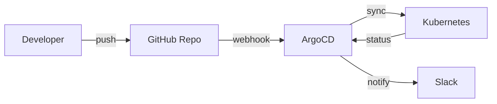

# GitOps Guide

ArgoCD configuration for CloudForge.

---

## 🏗️ GitOps Workflow



---

## 🚀 Install ArgoCD

### Kubernetes
```bash
kubectl create namespace argocd
kubectl apply -n argocd -f https://raw.githubusercontent.com/argoproj/argo-cd/stable/manifests/install.yaml

# Get password
kubectl -n argocd get secret argocd-initial-admin-secret -o jsonpath="{.data.password}" | base64 -d

# Access UI
kubectl port-forward svc/argocd-server -n argocd 8080:443
```

---

## 📁 ArgoCD Configuration

### Application (argocd/application.yaml)
```yaml
apiVersion: argoproj.io/v1alpha1
kind: Application
metadata:
  name: cloudforge
  namespace: argocd
spec:
  project: default
  source:
    repoURL: https://github.com/yourusername/cloudforge.git
    targetRevision: HEAD
    path: infrastructure/helm/cloudforge
    helm:
      valueFiles:
        - values-prod.yaml
  destination:
    server: https://kubernetes.default.svc
    namespace: cloudforge
  syncPolicy:
    automated:
      prune: true
      selfHeal: true
```

---

## 🔄 Sync Strategies

| Strategy | Use Case |
|----------|----------|
| **Manual** | Production deployments |
| **Auto-sync** | Development environments |
| **Self-heal** | Auto-fix drift |

---

## 📊 Access ArgoCD

| Service | URL | Credentials |
|---------|-----|-------------|
| ArgoCD UI | https://localhost:8080 | admin / (auto-generated) |

---

## 🔧 CLI Commands

```bash
# Login
argocd login localhost:8080

# List apps
argocd app list

# Sync app
argocd app sync cloudforge

# Get status
argocd app get cloudforge
```

---

## 📚 Next Steps

- [CI/CD Pipeline](ci-cd-pipeline.md) - CI integration
- [Kubernetes Guide](kubernetes-guide.md) - K8s deployment
