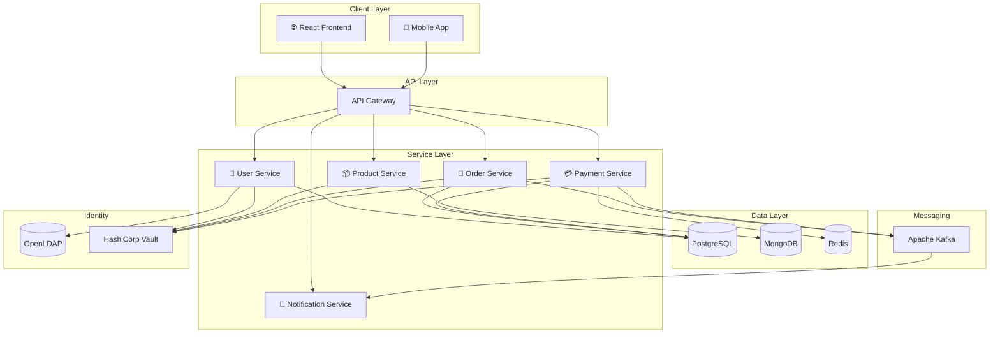
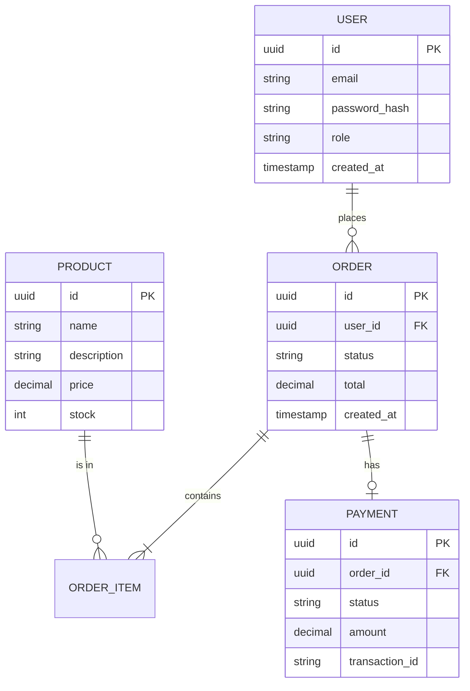

# System Architecture

CloudForge is a cloud-native e-commerce platform built using microservices architecture.

---

## 🏗️ High-Level Architecture



---

## 🧩 Microservices

### User Service
- **Responsibility:** Authentication, authorization, user management
- **Database:** PostgreSQL
- **Dependencies:** OpenLDAP, Vault
- **Port:** 8081

### Product Service
- **Responsibility:** Product catalog, categories, inventory
- **Database:** MongoDB
- **Port:** 8082

### Order Service
- **Responsibility:** Cart, orders, order history
- **Database:** PostgreSQL
- **Dependencies:** Product Service, Payment Service, Kafka
- **Port:** 8083

### Payment Service
- **Responsibility:** Payment processing, refunds, transactions
- **Database:** PostgreSQL
- **Dependencies:** Redis (idempotency), Kafka
- **Port:** 8084

### Notification Service
- **Responsibility:** Email/SMS notifications
- **Dependencies:** Kafka (event consumer)
- **Port:** 8085

---

## 🔄 Communication Patterns

| Pattern | Use Case |
|---------|----------|
| **Synchronous (REST)** | Frontend → Services, Service → Service queries |
| **Asynchronous (Kafka)** | Order events, Payment events → Notifications |

---

## 🗄️ Data Architecture



---

## 🔐 Security Architecture

```
┌─────────────────────────────────────────────────────────────────┐
│                      Security Layers                             │
├─────────────────────────────────────────────────────────────────┤
│  WAF / DDoS Protection (Azure Front Door)                       │
├─────────────────────────────────────────────────────────────────┤
│  TLS Termination (Ingress Controller)                           │
├─────────────────────────────────────────────────────────────────┤
│  Authentication (JWT + LDAP)                                    │
├─────────────────────────────────────────────────────────────────┤
│  Authorization (RBAC)                                           │
├─────────────────────────────────────────────────────────────────┤
│  Secrets Management (HashiCorp Vault)                           │
├─────────────────────────────────────────────────────────────────┤
│  Network Policies (K8s NetworkPolicy)                           │
└─────────────────────────────────────────────────────────────────┘
```

---

## 📊 Observability Stack

| Component | Tool | Purpose |
|-----------|------|---------|
| Metrics | Prometheus | Collect & store metrics |
| Visualization | Grafana | Dashboards |
| Logging | Loki | Log aggregation |
| Tracing | Zipkin | Distributed tracing |
| Alerting | Alertmanager | Alert routing |

---

## 🚀 Deployment Architecture

See [Kubernetes Guide](kubernetes-guide.md) and [Azure Deployment](azure-deployment.md) for details.
