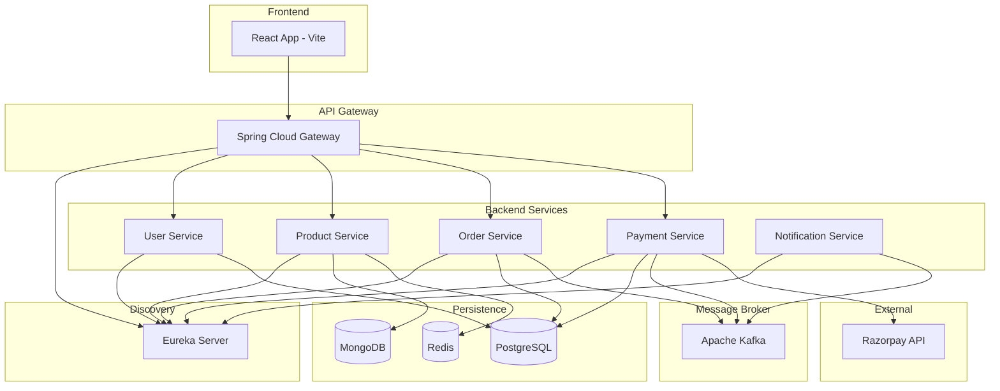

# System Architecture

CloudForge follows a microservices architecture pattern with an API Gateway for routing and service discovery.

## High-Level Diagram

## Services Overview

| Service | Port | Technology | Database | Description |
| :--- | :--- | :--- | :--- | :--- |
| **API Gateway** | 8080 | Spring Cloud Gateway | - | Routes requests, load balancing |
| **Discovery Server** | 8761 | Eureka Server | - | Service registration & discovery |
| **User Service** | 8081 | Spring Boot | PostgreSQL | Auth, JWT, user profiles |
| **Product Service** | 8082 | Spring Boot | MongoDB + Redis | Product catalog, inventory |
| **Order Service** | 8083 | Spring Boot | PostgreSQL | Order management |
| **Payment Service** | 8084 | Spring Boot | PostgreSQL | Razorpay integration |
| **Notification Service** | 8085 | Spring Boot | - | Email/SMS notifications |
| **Frontend** | 5173 | React + Vite | - | Amazon-style SPA |

## Technology Stack

### Frontend
- **React 18** with TypeScript
- **Vite** for fast builds
- **TailwindCSS** for styling
- **Zustand** for state management
- **TanStack Query** for data fetching
- **Razorpay** for payments

### Backend
- **Spring Boot 3** microservices
- **Spring Cloud Gateway** for API routing
- **Eureka** for service discovery
- **Apache Kafka** for async messaging
- **PostgreSQL** for relational data
- **MongoDB** for product documents
- **Redis** for caching

## Data Flow

1. **Request Routing**: All requests go through API Gateway which routes to appropriate services via Eureka
2. **Authentication**: User Service issues JWT tokens validated by all services
3. **Order Flow**: Orders → Kafka → Payment/Notification services
4. **Caching**: Product data cached in Redis for performance
