# CloudForge - Implementation Plan

> **Project Name:** CloudForge  
> **Tagline:** *Where cloud-native applications are forged*  
> **Goal:** Build a production-grade, enterprise-level DevOps project showcasing 25+ tools across the entire SDLC.

---

## 📋 Project Overview

This project demonstrates a complete DevOps lifecycle for a **5-microservice e-commerce platform** built with Java/Spring Boot. It includes:

- **Application Layer:** 5 Spring Boot microservices with LDAP auth & PostgreSQL
- **CI/CD Pipeline:** GitHub Actions with quality gates, security scanning, and GitOps
- **Local Development:** Docker Compose & Minikube on Windows
- **Production Deployment:** Azure AKS via Terraform
- **Observability:** Full metrics, logging, tracing, and alerting stack

---

## 🏗️ Architecture Diagram

```mermaid
flowchart TB
    subgraph "Developer Workstation"
        DEV[👨‍💻 Developer]
    end

    subgraph "Version Control"
        GH[GitHub Repository]
    end

    subgraph "CI Pipeline - GitHub Actions"
        CHECKOUT[📥 Checkout]
        BUILD[🔨 Maven Build]
        TEST[🧪 JUnit5 Tests]
        SONAR[🔍 SonarQube Scan]
        TRIVY[🛡️ Trivy Image Scan]
        ZAP[🔐 OWASP ZAP DAST]
        PUSH[📤 Push to Docker Hub]
    end

    subgraph "GitOps"
        ARGO[ArgoCD]
        HELM[Helm Charts]
    end

    subgraph "Kubernetes Cluster"
        subgraph "Application Layer"
            API[API Gateway]
            WEB[🌐 React Frontend]
            SVC1[👤 User Service]
            SVC2[📦 Product Service]
            SVC3[🛒 Order Service]
            SVC4[💳 Payment Service]
            SVC5[📧 Notification Service]
        end
        
        subgraph "Data Layer"
            PG[(PostgreSQL)]
            MONGO[(MongoDB)]
            LDAP[(OpenLDAP)]
            REDIS[(Redis)]
        end
        
        subgraph "Messaging"
            KAFKA[Apache Kafka]
        end
        
        subgraph "Observability"
            PROM[Prometheus]
            GRAF[Grafana]
            LOKI[Loki]
            JAEGER[Zipkin/Jaeger]
            ALERT[Alertmanager]
        end
        
        subgraph "Security"
            VAULT[HashiCorp Vault]
        end
    end

    subgraph "External"
        SLACK[💬 Slack]
        NEWRELIC[New Relic]
        DOCKERHUB[🐳 Docker Hub]
    end

    DEV -->|git push| GH
    GH -->|webhook| CHECKOUT
    CHECKOUT --> BUILD --> TEST --> SONAR --> TRIVY --> ZAP --> PUSH
    PUSH --> DOCKERHUB
    PUSH -->|update image tag| ARGO
    ARGO -->|sync| HELM
    HELM --> API
    
    API --> WEB
    API --> SVC1 & SVC2 & SVC3 & SVC4 & SVC5
    WEB -->|REST API| API
    SVC1 & SVC2 & SVC3 & SVC4 --> PG
    SVC2 --> MONGO
    SVC1 --> LDAP
    SVC3 --> SVC4
    SVC4 --> REDIS
    SVC3 & SVC4 -->|events| KAFKA
    KAFKA --> SVC5
    SVC1 & SVC2 & SVC3 & SVC4 & SVC5 --> VAULT
    
    SVC1 & SVC2 & SVC3 & SVC4 & SVC5 -.->|metrics| PROM
    PROM --> GRAF
    PROM --> ALERT --> SLACK
    SVC1 & SVC2 & SVC3 & SVC4 & SVC5 -.->|logs| LOKI
    SVC1 & SVC2 & SVC3 & SVC4 & SVC5 -.->|traces| JAEGER
    SVC1 & SVC2 & SVC3 & SVC4 & SVC5 -.->|APM| NEWRELIC
```



---

## 🧩 The 5 Microservices

| Service | Responsibility | Database | Key Endpoints |
|---------|---------------|----------|---------------|
| **User Service** | Authentication (LDAP), User management | PostgreSQL | `/api/users`, `/api/auth/login` |
| **Product Service** | Product catalog, inventory | PostgreSQL | `/api/products`, `/api/categories` |
| **Order Service** | Order placement, order history | PostgreSQL | `/api/orders`, `/api/cart` |
| **Payment Service** | Payment processing, refunds, transactions | PostgreSQL + Redis | `/api/payments`, `/api/refunds` |
| **Notification Service** | Email/SMS notifications (event-driven) | - | Kafka consumer (no REST API) |

Each service will expose:
- REST APIs with Swagger/OpenAPI
- Prometheus metrics endpoint (`/actuator/prometheus`)
- Health checks (`/actuator/health`)

---

## 🛠️ Complete Tool Stack

### Application & Testing
| Tool | Purpose |
|------|---------|
| Java 17 | Runtime |
| Spring Boot 3.x | Framework |
| Spring Security + LDAP | Authentication |
| PostgreSQL 15 | Relational database |
| MongoDB | Document database (Product catalog) |
| Redis | Caching & idempotency |
| Apache Kafka | Event streaming |
| JUnit 5 + Mockito | Unit & Integration Tests |
| Testcontainers | Integration test containers |

### Frontend
| Tool | Purpose |
|------|---------|
| React 18 | UI library |
| TypeScript | Type-safe JavaScript |
| Vite | Build tool & dev server |
| TailwindCSS | Utility-first CSS |
| React Query | Server state management |
| React Router | Client-side routing |
| Axios | HTTP client |
| Vitest | Unit testing |
| Playwright | E2E testing |

### CI/CD & Quality
| Tool | Purpose |
|------|---------|
| Git + GitHub | Version control |
| GitHub Actions | CI/CD orchestration |
| SonarQube | Code quality & SAST |
| Trivy | Container vulnerability scanning |
| OWASP ZAP | Dynamic security testing (DAST) |
| Docker Hub | Image registry |

### Containerization & Orchestration
| Tool | Purpose |
|------|---------|
| Docker | Containerization |
| Docker Compose | Local multi-container |
| Minikube | Local Kubernetes |
| Helm | K8s package manager |
| ArgoCD | GitOps CD |

### Infrastructure as Code
| Tool | Purpose |
|------|---------|
| Terraform | Azure infrastructure provisioning |
| Ansible | VM configuration (optional) |

### Observability
| Tool | Purpose |
|------|---------|
| Prometheus | Metrics collection |
| Grafana | Dashboards |
| Loki | Log aggregation |
| Zipkin | Distributed tracing |
| New Relic | APM (optional SaaS) |
| Alertmanager | Alert routing to Slack |

### Security
| Tool | Purpose |
|------|---------|
| HashiCorp Vault | Secrets management |
| OpenLDAP | User directory |

### Notifications
| Tool | Purpose |
|------|---------|
| Slack | Pipeline & alert notifications |

### Documentation
| Tool | Purpose |
|------|---------|
| Mintlify | Beautiful API & project documentation |
| Swagger/OpenAPI | API specifications |

---

## 📁 Project Folder Structure

```
cloudforge/
├── 📁 services/
│   ├── 📁 user-service/
│   │   ├── src/main/java/...
│   │   ├── src/test/java/...
│   │   ├── Dockerfile
│   │   └── pom.xml
│   ├── 📁 product-service/
│   │   ├── src/main/java/...
│   │   ├── Dockerfile
│   │   └── pom.xml
│   ├── 📁 order-service/
│   │   ├── src/main/java/...
│   │   ├── Dockerfile
│   │   └── pom.xml
│   ├── 📁 payment-service/
│   │   ├── src/main/java/...
│   │   ├── Dockerfile
│   │   └── pom.xml
│   └── 📁 notification-service/
│       ├── src/main/java/...
│       ├── Dockerfile
│       └── pom.xml
│
├── 📁 frontend/                          # React application
│   ├── src/
│   │   ├── components/
│   │   ├── pages/
│   │   ├── hooks/
│   │   ├── services/
│   │   ├── types/
│   │   └── App.tsx
│   ├── Dockerfile
│   ├── package.json
│   ├── vite.config.ts
│   ├── tailwind.config.js
│   └── tsconfig.json
│
├── 📁 infrastructure/
│   ├── 📁 docker/
│   │   └── docker-compose.yml           # Local dev stack
│   ├── 📁 helm/
│   │   └── 📁 microservices-platform/    # Umbrella Helm chart
│   │       ├── Chart.yaml
│   │       ├── values.yaml
│   │       ├── values-dev.yaml
│   │       ├── values-prod.yaml
│   │       └── 📁 charts/
│   │           ├── user-service/
│   │           ├── product-service/
│   │           ├── order-service/
│   │           ├── payment-service/
│   │           └── notification-service/
│   ├── 📁 terraform/
│   │   ├── 📁 azure/
│   │   │   ├── main.tf
│   │   │   ├── variables.tf
│   │   │   ├── outputs.tf
│   │   │   ├── aks.tf
│   │   │   ├── networking.tf
│   │   │   └── postgres.tf
│   │   └── 📁 modules/
│   └── 📁 ansible/
│       └── playbooks/
│
├── 📁 observability/
│   ├── 📁 prometheus/
│   │   └── prometheus.yml
│   ├── 📁 grafana/
│   │   └── dashboards/
│   ├── 📁 loki/
│   └── 📁 alertmanager/
│       └── alertmanager.yml
│
├── 📁 security/
│   ├── 📁 vault/
│   │   └── policies/
│   └── 📁 ldap/
│       └── bootstrap.ldif
│
├── 📁 .github/
│   └── 📁 workflows/
│       ├── ci.yml                        # Build, Test, Scan
│       ├── cd.yml                        # Deploy to environments
│       └── security-scan.yml             # OWASP ZAP scheduled
│
├── 📁 argocd/
│   ├── application.yaml
│   └── project.yaml
│
├── 📁 docs/
│   ├── architecture.md
│   ├── local-setup.md
│   └── azure-deployment.md
│
├── .gitignore
├── README.md
├── Makefile                              # Helper commands
│
├── 📁 mintlify/                          # Documentation site
│   ├── mint.json                         # Mintlify config
│   ├── introduction.mdx
│   ├── 📁 api-reference/
│   │   ├── user-service.mdx
│   │   ├── product-service.mdx
│   │   ├── order-service.mdx
│   │   └── payment-service.mdx
│   └── 📁 guides/
│       ├── getting-started.mdx
│       ├── local-development.mdx
│       └── deployment.mdx
```

---

## 🚀 Implementation Phases

### **Phase 1: Application Development (Week 1-3)**
- [ ] Initialize 5 Spring Boot services with Maven multi-module
- [ ] Implement REST APIs for each service
- [ ] Configure Spring Data JPA + PostgreSQL
- [ ] Configure Spring Data MongoDB for Product Service
- [ ] Integrate Spring Security with LDAP
- [ ] Write JUnit5 tests (aim for 70%+ coverage)
- [ ] Create Dockerfiles for each service
- [ ] **Frontend:** Initialize React app with Vite + TypeScript
- [ ] **Frontend:** Set up TailwindCSS, React Router, React Query
- [ ] **Frontend:** Build core pages (Login, Products, Cart, Orders)

### **Phase 2: Local Development Stack (Week 4)**
- [ ] Create `docker-compose.yml` with all services + frontend
- [ ] Add PostgreSQL, MongoDB, OpenLDAP containers
- [ ] Add local observability stack (Prometheus, Grafana, Loki)
- [ ] Verify all services communicate correctly
- [ ] Document local setup in `docs/local-setup.md`

### **Phase 3: CI Pipeline (Week 4)**
- [ ] Create GitHub Actions workflow for CI
  - [ ] Maven build & test
  - [ ] SonarQube analysis (use SonarCloud free tier)
  - [ ] Build Docker images
  - [ ] Trivy vulnerability scan
  - [ ] Push to Docker Hub
  - [ ] Slack notification on failure
- [ ] Create OWASP ZAP scheduled security scan

### **Phase 4: Kubernetes & GitOps (Week 5-6)**
- [ ] Install Minikube on Windows
- [ ] Create Helm charts for each microservice
- [ ] Create umbrella Helm chart
- [ ] Deploy to Minikube manually
- [ ] Install ArgoCD on Minikube
- [ ] Configure ArgoCD to sync from Git
- [ ] Test GitOps flow (push → auto-deploy)

### **Phase 5: Observability Stack (Week 7)**
- [ ] Deploy Prometheus + Grafana via Helm
- [ ] Create custom dashboards (Request rate, Error rate, Latency)
- [ ] Deploy Loki for centralized logging
- [ ] Configure Zipkin for distributed tracing
- [ ] Configure Alertmanager → Slack integration
- [ ] (Optional) Configure New Relic APM agent

### **Phase 6: Security Hardening (Week 8)**
- [ ] Deploy HashiCorp Vault on Kubernetes
- [ ] Store database credentials in Vault
- [ ] Configure services to fetch secrets from Vault
- [ ] Add Trivy to CI pipeline
- [ ] Add OWASP ZAP DAST scan

### **Phase 7: Azure Deployment (Week 9-10)**
- [ ] Write Terraform for Azure infrastructure:
  - [ ] Resource Group
  - [ ] Virtual Network + Subnets
  - [ ] AKS Cluster (2-3 nodes)
  - [ ] Azure Database for PostgreSQL
  - [ ] Azure Container Registry (or continue Docker Hub)
- [ ] Create `values-prod.yaml` for Helm
- [ ] Deploy to AKS using ArgoCD
- [ ] Configure DNS / Ingress
- [ ] Document in `docs/azure-deployment.md`

### **Phase 8: Documentation & Showcase (Week 11-12)**
- [ ] Set up Mintlify documentation site
- [ ] Write API reference docs for each service
- [ ] Create getting started & deployment guides
- [ ] Write comprehensive README with badges
- [ ] Create architecture diagrams
- [ ] Record demo video (Loom)
- [ ] Write Medium article: "Building CloudForge - An Enterprise DevOps Platform"
- [ ] Post project showcase to LinkedIn

---

## 🔧 CI/CD Pipeline Stages


---

## ✅ Verification Plan

### Automated Tests
| Test Type | Command | Tool |
|-----------|---------|------|
| Unit Tests | `mvn test` | JUnit5 + Mockito |
| Integration Tests | `mvn verify -Pintegration` | Testcontainers |
| Code Quality | SonarCloud Dashboard | SonarQube |
| Container Security | `trivy image <image>` | Trivy |
| API Security | OWASP ZAP baseline scan | OWASP ZAP |

### Manual Verification
| Step | Description |
|------|-------------|
| 1 | Run `docker-compose up` and verify all services start |
| 2 | Call `/actuator/health` on each service |
| 3 | Test login flow via LDAP |
| 4 | Create a product, place an order, verify in DB |
| 5 | Check Grafana dashboards show metrics |
| 6 | Check Loki shows logs from all services |
| 7 | Trigger an alert and verify Slack notification |

---

## 📝 Key Files to Create First

1. **`pom.xml`** (Parent POM with multi-module setup)
2. **`services/user-service/Dockerfile`**
3. **`infrastructure/docker/docker-compose.yml`**
4. **`.github/workflows/ci.yml`**
5. **`infrastructure/helm/microservices-platform/Chart.yaml`**
6. **`infrastructure/terraform/azure/main.tf`**

---

## User Review Required

> [!IMPORTANT]
> **This is a large project spanning 10-12 weeks.** Before proceeding, please confirm:
> 1. Do you want to start with **Phase 1** (building the microservices)?
> 2. Should I create the **folder structure** and **initial project files** now?
> 3. Do you have **Docker Desktop** and **Minikube** installed on Windows?
> 4. Do you have an **Azure account** for later phases?

---

*This plan will showcase mastery of 25+ DevOps tools and serve as a standout portfolio project.*
