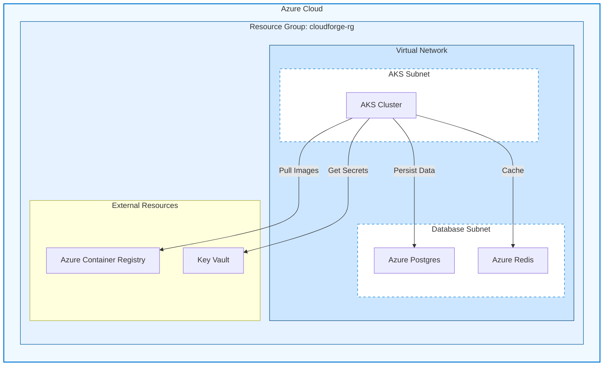

# Azure AKS Deployment Guide

This guide covers deploying CloudForge to Azure Kubernetes Service (AKS) using Terraform.

---

## 📋 Prerequisites

| Tool | Purpose |
|------|---------|
| Azure CLI | Azure resource management |
| Terraform | Infrastructure as Code |
| kubectl | Kubernetes CLI |
| Helm | K8s package manager |

### Azure Account Setup

```bash
# Login to Azure
az login

# Set subscription
az account set --subscription "Your Subscription Name"

# Create service principal for Terraform
az ad sp create-for-rbac --name "terraform-cloudforge" --role Contributor
```

---

## 🏗️ Infrastructure Architecture



---

## 🚀 Deployment Steps

### 1. Initialize Terraform

```bash
cd infrastructure/terraform/azure

# Initialize Terraform
terraform init

# Review the plan
terraform plan -out=tfplan

# Apply the infrastructure
terraform apply tfplan
```

### 2. Configure kubectl

```bash
# Get AKS credentials
az aks get-credentials --resource-group cloudforge-rg --name cloudforge-aks

# Verify connection
kubectl cluster-info
kubectl get nodes
```

### 3. Deploy Application

```bash
# Create namespace
kubectl create namespace cloudforge

# Deploy with Helm
helm install cloudforge ./infrastructure/helm/cloudforge \
  -n cloudforge \
  -f ./infrastructure/helm/cloudforge/values-prod.yaml
```

---

## 📁 Terraform Files

```
infrastructure/terraform/azure/
├── main.tf              # Main configuration
├── variables.tf         # Variable definitions
├── outputs.tf           # Output values
├── aks.tf               # AKS cluster
├── networking.tf        # VNet, subnets
├── postgres.tf          # Azure Database for PostgreSQL
├── redis.tf             # Azure Cache for Redis
├── acr.tf               # Container Registry
├── keyvault.tf          # Key Vault
└── terraform.tfvars     # Variable values (gitignored)
```

### main.tf

```hcl
terraform {
  required_providers {
    azurerm = {
      source  = "hashicorp/azurerm"
      version = "~> 3.0"
    }
  }
  
  backend "azurerm" {
    resource_group_name  = "terraform-state-rg"
    storage_account_name = "tfstatecloudforge"
    container_name       = "tfstate"
    key                  = "cloudforge.tfstate"
  }
}

provider "azurerm" {
  features {}
}

resource "azurerm_resource_group" "main" {
  name     = var.resource_group_name
  location = var.location
  
  tags = var.tags
}
```

### aks.tf

```hcl
resource "azurerm_kubernetes_cluster" "main" {
  name                = "${var.prefix}-aks"
  location            = azurerm_resource_group.main.location
  resource_group_name = azurerm_resource_group.main.name
  dns_prefix          = var.prefix
  kubernetes_version  = var.kubernetes_version

  default_node_pool {
    name                = "default"
    node_count          = var.node_count
    vm_size             = var.vm_size
    vnet_subnet_id      = azurerm_subnet.aks.id
    enable_auto_scaling = true
    min_count           = 2
    max_count           = 5
  }

  identity {
    type = "SystemAssigned"
  }

  network_profile {
    network_plugin    = "azure"
    load_balancer_sku = "standard"
  }

  tags = var.tags
}
```

---

## 🔧 Configuration

### terraform.tfvars

```hcl
prefix              = "cloudforge"
resource_group_name = "cloudforge-rg"
location            = "East US"
kubernetes_version  = "1.28"
node_count          = 3
vm_size             = "Standard_D2s_v3"

tags = {
  Environment = "Production"
  Project     = "CloudForge"
  ManagedBy   = "Terraform"
}
```

---

## 🔐 Secrets Management

```bash
# Store secrets in Azure Key Vault
az keyvault secret set --vault-name cloudforge-kv --name "postgres-password" --value "your-password"

# Access from AKS using CSI driver
kubectl apply -f infrastructure/helm/cloudforge/templates/secret-provider.yaml
```

---

## 📊 Post-Deployment

### Set up Ingress

```bash
# Install NGINX Ingress Controller
helm install ingress-nginx ingress-nginx/ingress-nginx \
  --namespace ingress-nginx --create-namespace
```

### Configure DNS

```bash
# Get Load Balancer IP
kubectl get svc ingress-nginx-controller -n ingress-nginx

# Create DNS record pointing to the IP
# cloudforge.yourdomain.com -> <LOAD_BALANCER_IP>
```

### Enable SSL/TLS

```bash
# Install cert-manager
helm install cert-manager jetstack/cert-manager \
  --namespace cert-manager --create-namespace \
  --set installCRDs=true
```

---

## 💰 Cost Optimization

| Resource | Recommendation |
|----------|---------------|
| AKS Nodes | Use spot instances for non-prod |
| PostgreSQL | Use Basic tier for dev |
| Redis | Use Basic C0 for dev |
| ACR | Use Basic tier |

---

## 🛑 Cleanup

```bash
# Destroy all Azure resources
terraform destroy

# Or delete resource group manually
az group delete --name cloudforge-rg --yes
```

---

## 📚 Next Steps

- [Monitoring](monitoring.md) - Azure Monitor integration
- [Security](security.md) - Azure Key Vault setup
- [CI/CD Pipeline](ci-cd-pipeline.md) - GitHub Actions for Azure
