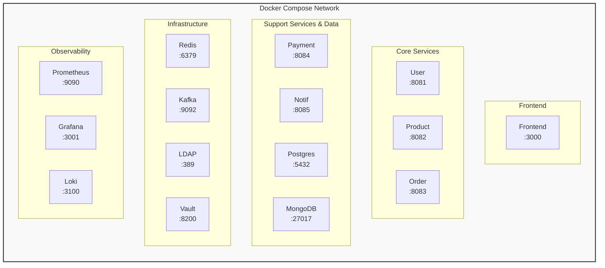

# Docker Deployment Guide

This guide covers deploying CloudForge using Docker and Docker Compose.

---

## 📋 Prerequisites

- Docker Desktop (Windows/Mac) or Docker Engine (Linux)
- Docker Compose v2.x
- 8GB+ RAM available for Docker

---

## 🏗️ Architecture



---

## 🚀 Quick Start

### Start Everything

```bash
# Build and start all services
docker-compose up -d --build

# Check status
docker-compose ps

# View combined logs
docker-compose logs -f
```

### Start Specific Services

```bash
# Infrastructure only
docker-compose up -d postgres mongodb redis kafka ldap vault

# Add observability
docker-compose up -d prometheus grafana loki

# Add application services
docker-compose up -d user-service product-service order-service payment-service notification-service

# Add frontend
docker-compose up -d frontend
```

---

## 📁 Docker Compose Files

| File | Purpose |
|------|---------|
| `docker-compose.yml` | Main configuration |
| `docker-compose.override.yml` | Local development overrides |
| `docker-compose.prod.yml` | Production configuration |

### Using Different Configurations

```bash
# Development (default)
docker-compose up -d

# Production
docker-compose -f docker-compose.yml -f docker-compose.prod.yml up -d
```

---

## 🔧 Service Configuration

### Environment Variables

```yaml
# docker-compose.yml snippet
services:
  user-service:
    environment:
      - SPRING_PROFILES_ACTIVE=docker
      - DATABASE_URL=jdbc:postgresql://postgres:5432/cloudforge
      - LDAP_URL=ldap://ldap:389
      - VAULT_ADDR=http://vault:8200
```

### Resource Limits

```yaml
services:
  user-service:
    deploy:
      resources:
        limits:
          cpus: '0.5'
          memory: 512M
        reservations:
          cpus: '0.25'
          memory: 256M
```

---

## 🔍 Accessing Services

| Service | URL | Credentials |
|---------|-----|-------------|
| Frontend | http://localhost:3000 | - |
| Grafana | http://localhost:3001 | admin / admin |
| Prometheus | http://localhost:9090 | - |
| Vault UI | http://localhost:8200 | Token: dev-token |

---

## 📊 Viewing Logs

```bash
# All services
docker-compose logs -f

# Specific service
docker-compose logs -f user-service

# Last 100 lines
docker-compose logs --tail=100 user-service

# Since specific time
docker-compose logs --since 1h user-service
```

---

## 🛑 Stopping Services

```bash
# Stop all services (keep data)
docker-compose stop

# Stop and remove containers
docker-compose down

# Stop and remove containers + volumes (⚠️ deletes data)
docker-compose down -v
```

---

## 🔄 Rebuilding Services

```bash
# Rebuild specific service
docker-compose build user-service
docker-compose up -d user-service

# Rebuild all services
docker-compose build
docker-compose up -d

# Force rebuild without cache
docker-compose build --no-cache
```

---

## 🐛 Troubleshooting

### Check Container Health
```bash
docker-compose ps
docker inspect <container_id> --format='{{json .State.Health}}'
```

### Enter Container Shell
```bash
docker-compose exec user-service /bin/sh
```

### Reset Everything
```bash
docker-compose down -v
docker system prune -a
docker-compose up -d --build
```

---

## 📚 Next Steps

- [Kubernetes Guide](kubernetes-guide.md) - Production K8s deployment
- [Monitoring](monitoring.md) - Prometheus & Grafana setup
