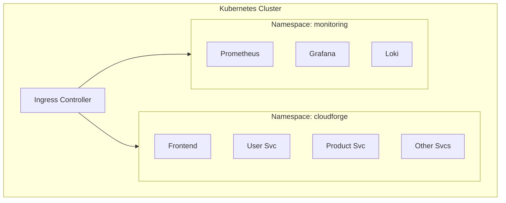

# Kubernetes Deployment Guide

This guide covers deploying CloudForge to Kubernetes using Minikube (local) and production clusters.

---

## 📋 Prerequisites

| Tool | Version | Installation |
|------|---------|--------------|
| kubectl | 1.28+ | [Install Guide](https://kubernetes.io/docs/tasks/tools/) |
| Helm | 3.x | [Install Guide](https://helm.sh/docs/intro/install/) |
| Minikube | Latest | [Install Guide](https://minikube.sigs.k8s.io/docs/start/) |

---

## 🏗️ Architecture on Kubernetes



---

## 🚀 Local Deployment (Minikube)

### 1. Start Minikube

```bash
# Start with sufficient resources
minikube start --cpus=4 --memory=8192 --driver=docker

# Enable required addons
minikube addons enable ingress
minikube addons enable metrics-server

# Verify
kubectl cluster-info
```

### 2. Create Namespaces

```bash
kubectl create namespace cloudforge
kubectl create namespace monitoring
kubectl create namespace argocd
```

### 3. Deploy with Helm

```bash
# Add Helm repositories
helm repo add bitnami https://charts.bitnami.com/bitnami
helm repo add prometheus-community https://prometheus-community.github.io/helm-charts
helm repo update

# Deploy infrastructure
helm install postgresql bitnami/postgresql -n cloudforge
helm install mongodb bitnami/mongodb -n cloudforge
helm install redis bitnami/redis -n cloudforge
helm install kafka bitnami/kafka -n cloudforge

# Deploy CloudForge application
helm install cloudforge ./infrastructure/helm/cloudforge -n cloudforge -f ./infrastructure/helm/cloudforge/values-dev.yaml
```

### 4. Access the Application

```bash
# Get Minikube IP
minikube ip

# Or use port-forwarding
kubectl port-forward svc/frontend 3000:80 -n cloudforge
kubectl port-forward svc/grafana 3001:80 -n monitoring
```

---

## 📦 Helm Chart Structure

```
infrastructure/helm/cloudforge/
├── Chart.yaml
├── values.yaml              # Default values
├── values-dev.yaml          # Development overrides
├── values-prod.yaml         # Production overrides
├── templates/
│   ├── _helpers.tpl
│   ├── deployment.yaml
│   ├── service.yaml
│   ├── ingress.yaml
│   ├── configmap.yaml
│   ├── secret.yaml
│   └── hpa.yaml
└── charts/                  # Subcharts for each service
    ├── user-service/
    ├── product-service/
    ├── order-service/
    ├── payment-service/
    └── notification-service/
```

---

## 🔧 Configuration

### values.yaml

```yaml
global:
  imageRegistry: docker.io
  imagePullSecrets: []

frontend:
  replicaCount: 2
  image:
    repository: yourusername/cloudforge-frontend
    tag: latest
  resources:
    limits:
      cpu: 200m
      memory: 256Mi

userService:
  replicaCount: 2
  image:
    repository: yourusername/cloudforge-user-service
    tag: latest
  resources:
    limits:
      cpu: 500m
      memory: 512Mi

# ... more services
```

---

## 🔍 Useful Commands

```bash
# View all resources
kubectl get all -n cloudforge

# View pods
kubectl get pods -n cloudforge

# View logs
kubectl logs -f deployment/user-service -n cloudforge

# Execute command in pod
kubectl exec -it <pod-name> -n cloudforge -- /bin/sh

# Port forward
kubectl port-forward svc/user-service 8081:8081 -n cloudforge

# Scale deployment
kubectl scale deployment user-service --replicas=3 -n cloudforge
```

---

## 📊 Deploy Monitoring Stack

```bash
# Prometheus + Grafana
helm install prometheus prometheus-community/kube-prometheus-stack \
  -n monitoring \
  --set grafana.adminPassword=admin123

# Access Grafana
kubectl port-forward svc/prometheus-grafana 3001:80 -n monitoring
```

---

## 🔄 GitOps with ArgoCD

```bash
# Install ArgoCD
kubectl apply -n argocd -f https://raw.githubusercontent.com/argoproj/argo-cd/stable/manifests/install.yaml

# Get initial password
kubectl -n argocd get secret argocd-initial-admin-secret -o jsonpath="{.data.password}" | base64 -d

# Access ArgoCD UI
kubectl port-forward svc/argocd-server -n argocd 8080:443

# Apply CloudForge application
kubectl apply -f argocd/application.yaml
```

---

## 🛑 Cleanup

```bash
# Delete CloudForge
helm uninstall cloudforge -n cloudforge

# Delete infrastructure
helm uninstall postgresql mongodb redis kafka -n cloudforge

# Delete namespaces
kubectl delete namespace cloudforge monitoring argocd

# Stop Minikube
minikube stop
minikube delete
```

---

## 📚 Next Steps

- [Azure Deployment](azure-deployment.md) - Production AKS
- [GitOps Guide](gitops.md) - ArgoCD setup
- [Monitoring](monitoring.md) - Prometheus & Grafana
