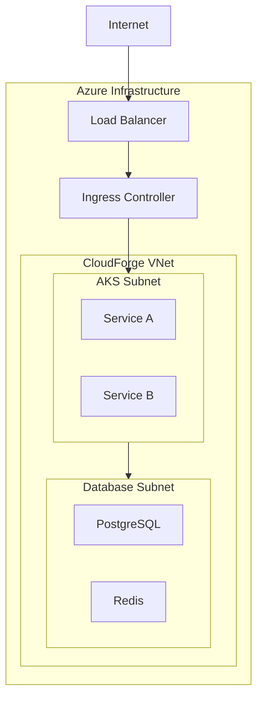

# Networking Guide

Network architecture and policies for CloudForge.

---

## 🌐 Network Architecture



---

## 🔒 Network Policies

### Default Deny
```yaml
apiVersion: networking.k8s.io/v1
kind: NetworkPolicy
metadata:
  name: default-deny
  namespace: cloudforge
spec:
  podSelector: {}
  policyTypes:
    - Ingress
    - Egress
```

### Allow Service Communication
```yaml
apiVersion: networking.k8s.io/v1
kind: NetworkPolicy
metadata:
  name: allow-service-to-postgres
spec:
  podSelector:
    matchLabels:
      app: user-service
  egress:
    - to:
        - podSelector:
            matchLabels:
              app: postgres
      ports:
        - port: 5432
```

---

## 🌍 DNS Configuration

| Service | Internal DNS | External DNS |
|---------|--------------|--------------|
| Frontend | frontend.cloudforge.svc | cloudforge.io |
| API Gateway | api-gateway.cloudforge.svc | api.cloudforge.io |
| User Service | user-service.cloudforge.svc | - |

---

## 🔐 TLS/SSL

### Ingress TLS
```yaml
apiVersion: networking.k8s.io/v1
kind: Ingress
spec:
  tls:
    - hosts:
        - api.cloudforge.io
      secretName: cloudforge-tls
```

### Internal mTLS
Service mesh (optional) for service-to-service encryption.

---

## 📊 Network Monitoring

```promql
# Network traffic
rate(container_network_receive_bytes_total[5m])
rate(container_network_transmit_bytes_total[5m])
```

---

## 📚 Related Docs

- [Kubernetes Guide](kubernetes-guide.md)
- [Security](security.md)
