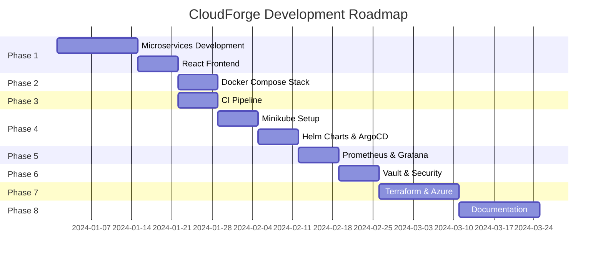

# Development Phases

Comprehensive guides for each phase of CloudForge development.

---

## 📅 Timeline Overview

| Phase | Duration | Focus Area |
|-------|----------|------------|
| [Phase 1](phase-1-application.md) | Weeks 1-3 | Application Development |
| [Phase 2](phase-2-local-stack.md) | Week 4 | Local Development Stack |
| [Phase 3](phase-3-ci-pipeline.md) | Week 4 | CI Pipeline |
| [Phase 4](phase-4-kubernetes.md) | Weeks 5-6 | Kubernetes & GitOps |
| [Phase 5](phase-5-observability.md) | Week 7 | Observability Stack |
| [Phase 6](phase-6-security.md) | Week 8 | Security Hardening |
| [Phase 7](phase-7-azure.md) | Weeks 9-10 | Azure Deployment |
| [Phase 8](phase-8-documentation.md) | Weeks 11-12 | Documentation & Showcase |

---

## 🗺️ Roadmap Diagram

---

## 📋 Quick Reference

### Phase 1: Application Development
- Initialize 5 Spring Boot microservices
- Configure PostgreSQL, MongoDB, Redis
- Integrate LDAP authentication
- Build React + TypeScript frontend
- Achieve 70%+ test coverage

### Phase 2: Local Development Stack
- Create docker-compose.yml
- Configure all databases
- Set up Kafka messaging
- Add local observability

### Phase 3: CI Pipeline
- GitHub Actions workflows
- SonarQube code analysis
- Trivy container scanning
- Slack notifications

### Phase 4: Kubernetes & GitOps
- Install Minikube
- Create Helm charts
- Deploy ArgoCD
- Configure GitOps sync

### Phase 5: Observability
- Deploy Prometheus + Grafana
- Configure Loki for logging
- Set up distributed tracing
- Create alert rules

### Phase 6: Security Hardening
- Deploy HashiCorp Vault
- Configure secrets injection
- Network policies
- RBAC configuration

### Phase 7: Azure Deployment
- Write Terraform modules
- Provision AKS cluster
- Deploy to production
- Configure DNS/Ingress

### Phase 8: Documentation & Showcase
- Mintlify documentation site
- Demo video recording
- Medium article
- LinkedIn showcase

---

## 🏆 Success Criteria

| Metric | Target |
|--------|--------|
| Microservices | 5 running services |
| Test Coverage | 70%+ |
| CI Pipeline Stages | 8+ |
| Security Scans | Trivy + ZAP |
| Grafana Dashboards | 5+ |
| Documentation Pages | 20+ |

---

## 📚 Related Documentation

- [Implementation Plan](../implementation_plan.md)
- [Architecture Overview](../architecture.md)
- [Local Setup Guide](../local-setup.md)
