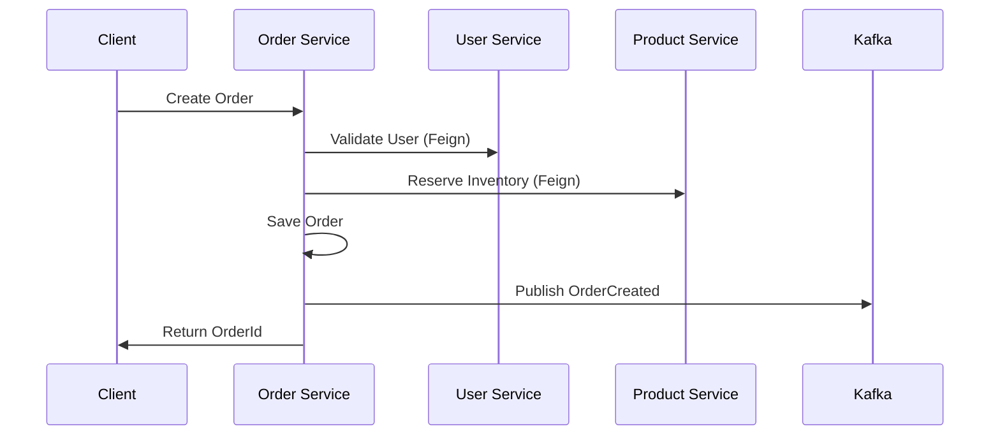

# Phase 1: Application Development

**Duration:** Weeks 1-3  
**Goal:** Build fully functional microservices and React frontend

---

## 📋 Objectives

| Objective | Status | Priority |
|-----------|--------|----------|
| Initialize Spring Boot microservices | ⬜ | P0 |
| Implement REST APIs | ⬜ | P0 |
| Configure databases (PostgreSQL, MongoDB) | ⬜ | P0 |
| Integrate LDAP authentication | ⬜ | P1 |
| Build React frontend | ⬜ | P0 |
| Achieve 70%+ test coverage | ⬜ | P1 |

---

## 🏗️ Week 1: Project Setup & Core Services

### Day 1-2: Project Initialization

```bash
# Create parent project structure
mkdir cloudforge && cd cloudforge
mkdir -p services/{user-service,product-service,order-service,payment-service,notification-service}
mkdir -p frontend infrastructure docs
```

#### [ ] Create Parent POM
```xml
<!-- pom.xml -->
<project>
    <groupId>io.cloudforge</groupId>
    <artifactId>cloudforge-parent</artifactId>
    <version>1.0.0-SNAPSHOT</version>
    <packaging>pom</packaging>
    
    <modules>
        <module>services/user-service</module>
        <module>services/product-service</module>
        <module>services/order-service</module>
        <module>services/payment-service</module>
        <module>services/notification-service</module>
    </modules>
    
    <properties>
        <java.version>17</java.version>
        <spring-boot.version>3.2.0</spring-boot.version>
        <spring-cloud.version>2023.0.0</spring-cloud.version>
    </properties>
</project>
```

### Day 3-4: User Service

#### [ ] Core Implementation
- [ ] Create `UserController` with CRUD endpoints
- [ ] Create `AuthController` for login/register
- [ ] Implement `UserService` with business logic
- [ ] Configure PostgreSQL with Flyway migrations
- [ ] Integrate Spring Security + LDAP

#### [ ] API Endpoints
| Method | Endpoint | Description |
|--------|----------|-------------|
| POST | `/api/auth/login` | LDAP authentication |
| POST | `/api/auth/register` | Create new user |
| GET | `/api/users/me` | Get current user |
| PUT | `/api/users/me` | Update profile |
| GET | `/api/users` | List users (admin) |

### Day 5: Product Service

#### [ ] Core Implementation
- [ ] Configure MongoDB connection
- [ ] Create `Product` document model
- [ ] Implement `ProductRepository` with queries
- [ ] Create `ProductService` with caching
- [ ] Configure Redis for caching

#### [ ] API Endpoints
| Method | Endpoint | Description |
|--------|----------|-------------|
| GET | `/api/products` | List with pagination |
| GET | `/api/products/{id}` | Get by ID |
| POST | `/api/products` | Create product |
| PUT | `/api/products/{id}` | Update product |
| DELETE | `/api/products/{id}` | Delete product |
| GET | `/api/products/search` | Text search |

---

## 🏗️ Week 2: Order, Payment & Notification Services

### Day 1-2: Order Service

#### [ ] Core Implementation
- [ ] Create `Order`, `OrderItem` entities
- [ ] Implement Saga pattern for distributed transactions
- [ ] Create Feign clients for User & Product services
- [ ] Configure Kafka producer for events
- [ ] Implement Redis cart management

#### [ ] Order Flow


### Day 3-4: Payment Service

#### [ ] Core Implementation
- [ ] Integrate Stripe SDK
- [ ] Create `Payment` entity
- [ ] Implement idempotency with Redis
- [ ] Configure Kafka consumer for orders
- [ ] Publish PaymentCompleted events

#### [ ] Stripe Integration
```java
@Service
public class StripePaymentService {
    @Value("${stripe.api-key}")
    private String stripeApiKey;
    
    public PaymentIntent createPayment(PaymentRequest request) {
        Stripe.apiKey = stripeApiKey;
        return PaymentIntent.create(
            PaymentIntentCreateParams.builder()
                .setAmount(request.getAmount())
                .setCurrency("usd")
                .setPaymentMethod(request.getPaymentMethodId())
                .setConfirm(true)
                .build()
        );
    }
}
```

### Day 5: Notification Service

#### [ ] Core Implementation
- [ ] Configure Kafka consumers for all events
- [ ] Integrate JavaMailSender + SendGrid
- [ ] Create Thymeleaf email templates
- [ ] Store notification history in PostgreSQL
- [ ] Implement async processing

---

## 🏗️ Week 3: Frontend Development

### Day 1-2: Project Setup

```bash
cd frontend
npm create vite@latest . -- --template react-ts
npm install tailwindcss postcss autoprefixer
npm install @tanstack/react-query zustand react-router-dom axios
npm install react-hook-form @hookform/resolvers zod
npm install lucide-react framer-motion
```

#### [ ] Configure Project
- [ ] Set up TailwindCSS
- [ ] Configure path aliases
- [ ] Create folder structure
- [ ] Set up ESLint + Prettier

### Day 3-4: Core Pages

#### [ ] Implement Pages
- [ ] `LoginPage` - LDAP authentication form
- [ ] `HomePage` - Hero, featured products
- [ ] `ProductsPage` - Catalog with filters
- [ ] `ProductDetailPage` - Product view
- [ ] `CartPage` - Shopping cart
- [ ] `CheckoutPage` - Multi-step checkout
- [ ] `OrdersPage` - Order history

### Day 5: Integration & Polish

#### [ ] API Integration
- [ ] Configure Axios instance with interceptors
- [ ] Create service layer for each API
- [ ] Implement React Query hooks
- [ ] Add loading states and error handling
- [ ] Implement toast notifications

---

## ✅ Phase 1 Checklist

### Backend
- [ ] All 5 microservices running
- [ ] PostgreSQL migrations applied
- [ ] MongoDB collections created
- [ ] LDAP authentication working
- [ ] Kafka messaging functional
- [ ] Redis caching enabled
- [ ] All endpoints documented (OpenAPI)
- [ ] 70%+ test coverage

### Frontend
- [ ] All pages implemented
- [ ] Forms validated with Zod
- [ ] State management working
- [ ] API integration complete
- [ ] Responsive design

### Documentation
- [ ] API endpoints documented
- [ ] README updated
- [ ] Architecture diagrams created

---

## 🧪 Verification

```bash
# Start all services
docker-compose up -d

# Health checks
curl http://localhost:8081/actuator/health  # User Service
curl http://localhost:8082/actuator/health  # Product Service
curl http://localhost:8083/actuator/health  # Order Service

# Test login
curl -X POST http://localhost:8081/api/auth/login \
  -H "Content-Type: application/json" \
  -d '{"username":"admin","password":"admin123"}'

# Test frontend
npm run dev  # Should open on http://localhost:5173
```

---

## 📚 Related Docs

- [User Service Guide](../services/user-service-guide.md)
- [Product Service Guide](../services/product-service-guide.md)
- [Order Service Guide](../services/order-service-guide.md)
- [React Development Guide](../react-development.md)

---

**Next Phase:** [Phase 2 - Local Development Stack](phase-2-local-stack.md)
