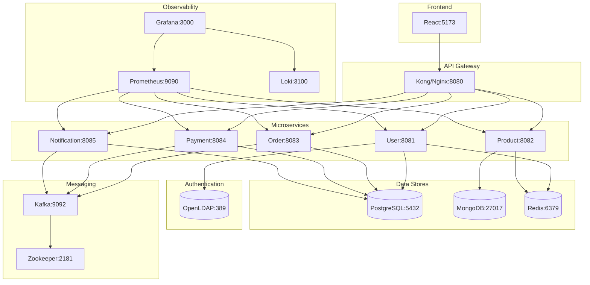

# Phase 2: Local Development Stack

**Duration:** Week 4  
**Goal:** Complete Docker Compose environment for local development

---

## 📋 Objectives

| Objective | Status | Priority |
|-----------|--------|----------|
| Create docker-compose.yml | ⬜ | P0 |
| Configure all databases | ⬜ | P0 |
| Set up messaging (Kafka) | ⬜ | P0 |
| Add local observability | ⬜ | P1 |
| Document local setup | ⬜ | P1 |

---

## 🐳 Docker Compose Architecture



---

## 📁 File Structure

```
infrastructure/docker/
├── docker-compose.yml          # Main compose file
├── docker-compose.override.yml # Local overrides
├── .env                        # Environment variables
├── postgres/
│   └── init.sql               # Database initialization
├── mongodb/
│   └── init.js                # MongoDB initialization
├── ldap/
│   └── bootstrap.ldif         # LDAP seed data
├── kafka/
│   └── create-topics.sh       # Topic creation script
├── prometheus/
│   └── prometheus.yml         # Prometheus config
├── grafana/
│   ├── provisioning/
│   │   ├── datasources/
│   │   └── dashboards/
│   └── dashboards/
│       └── microservices.json
└── loki/
    └── loki-config.yml
```

---

## 🔧 Docker Compose Configuration

### Main docker-compose.yml

```yaml
version: '3.8'

services:
  # ============= DATABASES =============
  postgres:
    image: postgres:15-alpine
    container_name: cloudforge-postgres
    environment:
      POSTGRES_USER: cloudforge
      POSTGRES_PASSWORD: cloudforge123
      POSTGRES_MULTIPLE_DATABASES: users,orders,payments,notifications
    volumes:
      - postgres_data:/var/lib/postgresql/data
      - ./postgres/init.sql:/docker-entrypoint-initdb.d/init.sql
    ports:
      - "5432:5432"
    healthcheck:
      test: ["CMD-SHELL", "pg_isready -U cloudforge"]
      interval: 10s
      timeout: 5s
      retries: 5

  mongodb:
    image: mongo:7
    container_name: cloudforge-mongodb
    environment:
      MONGO_INITDB_ROOT_USERNAME: cloudforge
      MONGO_INITDB_ROOT_PASSWORD: cloudforge123
      MONGO_INITDB_DATABASE: products
    volumes:
      - mongodb_data:/data/db
      - ./mongodb/init.js:/docker-entrypoint-initdb.d/init.js
    ports:
      - "27017:27017"

  redis:
    image: redis:7-alpine
    container_name: cloudforge-redis
    command: redis-server --requirepass cloudforge123
    ports:
      - "6379:6379"
    volumes:
      - redis_data:/data

  # ============= LDAP =============
  openldap:
    image: osixia/openldap:1.5.0
    container_name: cloudforge-ldap
    environment:
      LDAP_ORGANISATION: CloudForge
      LDAP_DOMAIN: cloudforge.io
      LDAP_ADMIN_PASSWORD: admin123
    volumes:
      - ldap_data:/var/lib/ldap
      - ./ldap/bootstrap.ldif:/container/service/slapd/assets/config/bootstrap/ldif/custom/bootstrap.ldif
    ports:
      - "389:389"
      - "636:636"

  # ============= MESSAGING =============
  zookeeper:
    image: confluentinc/cp-zookeeper:7.5.0
    container_name: cloudforge-zookeeper
    environment:
      ZOOKEEPER_CLIENT_PORT: 2181
    ports:
      - "2181:2181"

  kafka:
    image: confluentinc/cp-kafka:7.5.0
    container_name: cloudforge-kafka
    depends_on:
      - zookeeper
    environment:
      KAFKA_BROKER_ID: 1
      KAFKA_ZOOKEEPER_CONNECT: zookeeper:2181
      KAFKA_ADVERTISED_LISTENERS: PLAINTEXT://kafka:29092,PLAINTEXT_HOST://localhost:9092
      KAFKA_LISTENER_SECURITY_PROTOCOL_MAP: PLAINTEXT:PLAINTEXT,PLAINTEXT_HOST:PLAINTEXT
      KAFKA_OFFSETS_TOPIC_REPLICATION_FACTOR: 1
    ports:
      - "9092:9092"
    volumes:
      - kafka_data:/var/lib/kafka/data

  # ============= MICROSERVICES =============
  user-service:
    build: ../../services/user-service
    container_name: cloudforge-user-service
    depends_on:
      postgres:
        condition: service_healthy
      openldap:
        condition: service_started
      redis:
        condition: service_started
    environment:
      SPRING_PROFILES_ACTIVE: docker
      DB_HOST: postgres
      LDAP_URL: ldap://openldap:389
      REDIS_HOST: redis
    ports:
      - "8081:8081"

  product-service:
    build: ../../services/product-service
    container_name: cloudforge-product-service
    depends_on:
      - mongodb
      - redis
    environment:
      SPRING_PROFILES_ACTIVE: docker
      MONGODB_HOST: mongodb
      REDIS_HOST: redis
    ports:
      - "8082:8082"

  order-service:
    build: ../../services/order-service
    container_name: cloudforge-order-service
    depends_on:
      postgres:
        condition: service_healthy
      kafka:
        condition: service_started
      redis:
        condition: service_started
    environment:
      SPRING_PROFILES_ACTIVE: docker
      DB_HOST: postgres
      KAFKA_BOOTSTRAP_SERVERS: kafka:29092
      REDIS_HOST: redis
    ports:
      - "8083:8083"

  payment-service:
    build: ../../services/payment-service
    container_name: cloudforge-payment-service
    depends_on:
      postgres:
        condition: service_healthy
      kafka:
        condition: service_started
    environment:
      SPRING_PROFILES_ACTIVE: docker
      DB_HOST: postgres
      KAFKA_BOOTSTRAP_SERVERS: kafka:29092
      STRIPE_API_KEY: ${STRIPE_API_KEY}
    ports:
      - "8084:8084"

  notification-service:
    build: ../../services/notification-service
    container_name: cloudforge-notification-service
    depends_on:
      postgres:
        condition: service_healthy
      kafka:
        condition: service_started
    environment:
      SPRING_PROFILES_ACTIVE: docker
      DB_HOST: postgres
      KAFKA_BOOTSTRAP_SERVERS: kafka:29092
    ports:
      - "8085:8085"

  # ============= FRONTEND =============
  frontend:
    build: ../../frontend
    container_name: cloudforge-frontend
    ports:
      - "5173:80"
    depends_on:
      - user-service
      - product-service

  # ============= OBSERVABILITY =============
  prometheus:
    image: prom/prometheus:v2.47.0
    container_name: cloudforge-prometheus
    volumes:
      - ./prometheus/prometheus.yml:/etc/prometheus/prometheus.yml
      - prometheus_data:/prometheus
    command:
      - '--config.file=/etc/prometheus/prometheus.yml'
    ports:
      - "9090:9090"

  grafana:
    image: grafana/grafana:10.2.0
    container_name: cloudforge-grafana
    environment:
      GF_SECURITY_ADMIN_PASSWORD: admin123
    volumes:
      - grafana_data:/var/lib/grafana
      - ./grafana/provisioning:/etc/grafana/provisioning
    ports:
      - "3000:3000"
    depends_on:
      - prometheus
      - loki

  loki:
    image: grafana/loki:2.9.0
    container_name: cloudforge-loki
    volumes:
      - ./loki/loki-config.yml:/etc/loki/local-config.yaml
      - loki_data:/loki
    ports:
      - "3100:3100"
    command: -config.file=/etc/loki/local-config.yaml

volumes:
  postgres_data:
  mongodb_data:
  redis_data:
  ldap_data:
  kafka_data:
  prometheus_data:
  grafana_data:
  loki_data:
```

---

## ⚙️ Configuration Files

### PostgreSQL Initialization
```sql
-- postgres/init.sql
CREATE DATABASE users;
CREATE DATABASE orders;
CREATE DATABASE payments;
CREATE DATABASE notifications;

\c users
CREATE EXTENSION IF NOT EXISTS "uuid-ossp";

\c orders
CREATE EXTENSION IF NOT EXISTS "uuid-ossp";

\c payments
CREATE EXTENSION IF NOT EXISTS "uuid-ossp";

\c notifications
CREATE EXTENSION IF NOT EXISTS "uuid-ossp";
```

### LDAP Bootstrap
```ldif
# ldap/bootstrap.ldif
dn: ou=users,dc=cloudforge,dc=io
objectClass: organizationalUnit
ou: users

dn: ou=groups,dc=cloudforge,dc=io
objectClass: organizationalUnit
ou: groups

dn: uid=admin,ou=users,dc=cloudforge,dc=io
objectClass: inetOrgPerson
cn: Admin User
sn: User
uid: admin
userPassword: admin123
mail: admin@cloudforge.io

dn: cn=ROLE_ADMIN,ou=groups,dc=cloudforge,dc=io
objectClass: groupOfNames
cn: ROLE_ADMIN
member: uid=admin,ou=users,dc=cloudforge,dc=io
```

### Prometheus Config
```yaml
# prometheus/prometheus.yml
global:
  scrape_interval: 15s

scrape_configs:
  - job_name: 'user-service'
    metrics_path: '/actuator/prometheus'
    static_configs:
      - targets: ['user-service:8081']

  - job_name: 'product-service'
    metrics_path: '/actuator/prometheus'
    static_configs:
      - targets: ['product-service:8082']

  - job_name: 'order-service'
    metrics_path: '/actuator/prometheus'
    static_configs:
      - targets: ['order-service:8083']

  - job_name: 'payment-service'
    metrics_path: '/actuator/prometheus'
    static_configs:
      - targets: ['payment-service:8084']

  - job_name: 'notification-service'
    metrics_path: '/actuator/prometheus'
    static_configs:
      - targets: ['notification-service:8085']
```

---

## ✅ Phase 2 Checklist

- [ ] docker-compose.yml created
- [ ] All databases initialized
- [ ] LDAP configured with test users
- [ ] Kafka topics created
- [ ] All services starting correctly
- [ ] Health checks passing
- [ ] Prometheus scraping metrics
- [ ] Grafana accessible with dashboards
- [ ] Loki collecting logs
- [ ] Local setup documented

---

## 🧪 Verification

```bash
# Start all containers
docker-compose up -d

# Check container status
docker-compose ps

# Health checks
curl http://localhost:8081/actuator/health
curl http://localhost:8082/actuator/health
curl http://localhost:8083/actuator/health

# Access UIs
# Grafana: http://localhost:3000 (admin/admin123)
# Prometheus: http://localhost:9090
# Frontend: http://localhost:5173
```

---

**Next Phase:** [Phase 3 - CI Pipeline](phase-3-ci-pipeline.md)
