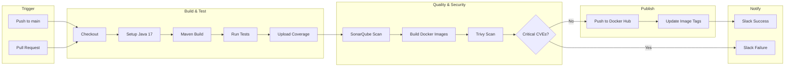

# Phase 3: CI Pipeline

**Duration:** Week 4  
**Goal:** Automated build, test, and security scanning with GitHub Actions

---

## 📋 Objectives

| Objective | Status | Priority |
|-----------|--------|----------|
| GitHub Actions CI workflow | ⬜ | P0 |
| Maven build & test | ⬜ | P0 |
| SonarQube code analysis | ⬜ | P1 |
| Docker image build | ⬜ | P0 |
| Trivy security scan | ⬜ | P1 |
| Slack notifications | ⬜ | P2 |
| OWASP ZAP scheduled scan | ⬜ | P2 |

---

## 🔄 CI Pipeline Flow



---

## 📁 Workflow Files

```
.github/
├── workflows/
│   ├── ci.yml              # Main CI pipeline
│   ├── security-scan.yml   # Scheduled OWASP ZAP
│   └── pr-checks.yml       # Pull request validation
└── CODEOWNERS
```

---

## 🔧 Main CI Workflow

```yaml
# .github/workflows/ci.yml
name: CI Pipeline

on:
  push:
    branches: [main, develop]
  pull_request:
    branches: [main]

env:
  JAVA_VERSION: '17'
  DOCKER_REGISTRY: docker.io
  DOCKER_USERNAME: ${{ secrets.DOCKER_USERNAME }}

jobs:
  # ============= BUILD & TEST =============
  build:
    runs-on: ubuntu-latest
    strategy:
      matrix:
        service: [user-service, product-service, order-service, payment-service, notification-service]
    
    steps:
      - name: Checkout code
        uses: actions/checkout@v4
        with:
          fetch-depth: 0  # For SonarQube

      - name: Set up JDK 17
        uses: actions/setup-java@v4
        with:
          java-version: ${{ env.JAVA_VERSION }}
          distribution: 'temurin'
          cache: 'maven'

      - name: Build with Maven
        run: |
          cd services/${{ matrix.service }}
          mvn clean package -DskipTests

      - name: Run Tests
        run: |
          cd services/${{ matrix.service }}
          mvn test

      - name: Generate Test Report
        uses: dorny/test-reporter@v1
        if: always()
        with:
          name: Test Results - ${{ matrix.service }}
          path: services/${{ matrix.service }}/target/surefire-reports/*.xml
          reporter: java-junit

      - name: Upload Coverage to Codecov
        uses: codecov/codecov-action@v3
        with:
          file: services/${{ matrix.service }}/target/site/jacoco/jacoco.xml
          flags: ${{ matrix.service }}

      - name: Upload artifacts
        uses: actions/upload-artifact@v4
        with:
          name: ${{ matrix.service }}-jar
          path: services/${{ matrix.service }}/target/*.jar

  # ============= SONARQUBE =============
  sonar:
    runs-on: ubuntu-latest
    needs: build
    
    steps:
      - name: Checkout
        uses: actions/checkout@v4
        with:
          fetch-depth: 0

      - name: Set up JDK 17
        uses: actions/setup-java@v4
        with:
          java-version: ${{ env.JAVA_VERSION }}
          distribution: 'temurin'
          cache: 'maven'

      - name: SonarQube Scan
        env:
          SONAR_TOKEN: ${{ secrets.SONAR_TOKEN }}
          SONAR_HOST_URL: ${{ secrets.SONAR_HOST_URL }}
        run: |
          mvn verify sonar:sonar \
            -Dsonar.projectKey=cloudforge \
            -Dsonar.organization=${{ secrets.SONAR_ORG }}

  # ============= DOCKER BUILD =============
  docker:
    runs-on: ubuntu-latest
    needs: build
    if: github.event_name == 'push' && github.ref == 'refs/heads/main'
    
    strategy:
      matrix:
        service: [user-service, product-service, order-service, payment-service, notification-service]
    
    steps:
      - name: Checkout
        uses: actions/checkout@v4

      - name: Download artifacts
        uses: actions/download-artifact@v4
        with:
          name: ${{ matrix.service }}-jar
          path: services/${{ matrix.service }}/target

      - name: Set up Docker Buildx
        uses: docker/setup-buildx-action@v3

      - name: Login to Docker Hub
        uses: docker/login-action@v3
        with:
          username: ${{ secrets.DOCKER_USERNAME }}
          password: ${{ secrets.DOCKER_PASSWORD }}

      - name: Extract metadata
        id: meta
        uses: docker/metadata-action@v5
        with:
          images: ${{ env.DOCKER_USERNAME }}/cloudforge-${{ matrix.service }}
          tags: |
            type=sha,prefix=
            type=ref,event=branch
            latest

      - name: Build Docker image
        uses: docker/build-push-action@v5
        with:
          context: services/${{ matrix.service }}
          file: services/${{ matrix.service }}/Dockerfile
          push: false
          load: true
          tags: ${{ steps.meta.outputs.tags }}
          cache-from: type=gha
          cache-to: type=gha,mode=max

      - name: Run Trivy scan
        uses: aquasecurity/trivy-action@master
        with:
          image-ref: ${{ env.DOCKER_USERNAME }}/cloudforge-${{ matrix.service }}:latest
          format: 'sarif'
          output: 'trivy-results.sarif'
          severity: 'CRITICAL,HIGH'
          exit-code: '1'

      - name: Upload Trivy results
        uses: github/codeql-action/upload-sarif@v2
        if: always()
        with:
          sarif_file: 'trivy-results.sarif'

      - name: Push Docker image
        uses: docker/build-push-action@v5
        with:
          context: services/${{ matrix.service }}
          file: services/${{ matrix.service }}/Dockerfile
          push: true
          tags: ${{ steps.meta.outputs.tags }}

  # ============= FRONTEND =============
  frontend:
    runs-on: ubuntu-latest
    
    steps:
      - name: Checkout
        uses: actions/checkout@v4

      - name: Setup Node.js
        uses: actions/setup-node@v4
        with:
          node-version: '18'
          cache: 'npm'
          cache-dependency-path: frontend/package-lock.json

      - name: Install dependencies
        run: |
          cd frontend
          npm ci

      - name: Run linting
        run: |
          cd frontend
          npm run lint

      - name: Run tests
        run: |
          cd frontend
          npm test -- --coverage

      - name: Build
        run: |
          cd frontend
          npm run build

      - name: Build Docker image
        if: github.event_name == 'push' && github.ref == 'refs/heads/main'
        uses: docker/build-push-action@v5
        with:
          context: frontend
          push: true
          tags: ${{ env.DOCKER_USERNAME }}/cloudforge-frontend:latest

  # ============= NOTIFY =============
  notify:
    runs-on: ubuntu-latest
    needs: [build, docker, frontend]
    if: always()
    
    steps:
      - name: Slack Notification
        uses: 8398a7/action-slack@v3
        with:
          status: ${{ job.status }}
          channel: '#cloudforge-ci'
          fields: repo,message,commit,author,action,eventName,ref,workflow
        env:
          SLACK_WEBHOOK_URL: ${{ secrets.SLACK_WEBHOOK }}
```

---

## 🔐 Security Scan Workflow

```yaml
# .github/workflows/security-scan.yml
name: Security Scan

on:
  schedule:
    - cron: '0 6 * * 1'  # Every Monday at 6 AM
  workflow_dispatch:

jobs:
  zap-scan:
    runs-on: ubuntu-latest
    
    steps:
      - name: Checkout
        uses: actions/checkout@v4

      - name: Start application
        run: docker-compose up -d
        working-directory: infrastructure/docker

      - name: Wait for services
        run: sleep 60

      - name: OWASP ZAP Baseline Scan
        uses: zaproxy/action-baseline@v0.9.0
        with:
          target: 'http://localhost:8080'
          rules_file_name: '.zap/rules.tsv'
          cmd_options: '-a'

      - name: Upload ZAP Report
        uses: actions/upload-artifact@v4
        with:
          name: zap-report
          path: report_html.html

      - name: Stop application
        run: docker-compose down
        working-directory: infrastructure/docker
```

---

## 🔑 Required Secrets

| Secret | Description |
|--------|-------------|
| `DOCKER_USERNAME` | Docker Hub username |
| `DOCKER_PASSWORD` | Docker Hub access token |
| `SONAR_TOKEN` | SonarCloud token |
| `SONAR_HOST_URL` | SonarCloud URL |
| `SONAR_ORG` | SonarCloud organization |
| `SLACK_WEBHOOK` | Slack webhook URL |
| `CODECOV_TOKEN` | Codecov upload token |

---

## ✅ Phase 3 Checklist

- [ ] CI workflow created
- [ ] All services building successfully
- [ ] Tests running and passing
- [ ] SonarQube integration working
- [ ] Docker images building
- [ ] Trivy scans running
- [ ] Images pushed to Docker Hub
- [ ] Slack notifications working
- [ ] OWASP ZAP scheduled scan configured
- [ ] Branch protection rules set

---

## 🧪 Verification

```bash
# Trigger CI manually
git push origin main

# Check workflow runs
gh run list

# View workflow logs
gh run view <run-id>

# Check Docker Hub for images
docker pull <username>/cloudforge-user-service:latest
```

---

**Next Phase:** [Phase 4 - Kubernetes & GitOps](phase-4-kubernetes.md)
