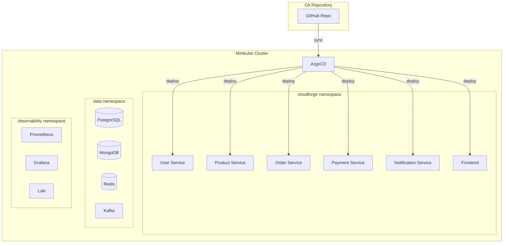

# Phase 4: Kubernetes & GitOps

**Duration:** Weeks 5-6  
**Goal:** Deploy to Minikube with Helm and ArgoCD

---

## 📋 Objectives

| Objective | Status | Priority |
|-----------|--------|----------|
| Install Minikube on Windows | ⬜ | P0 |
| Create Helm charts | ⬜ | P0 |
| Deploy to Minikube | ⬜ | P0 |
| Install ArgoCD | ⬜ | P1 |
| Configure GitOps sync | ⬜ | P1 |

---

## 🏗️ Architecture



---

## 🛠️ Week 5: Minikube & Helm

### Day 1: Minikube Setup

```powershell
# Install Minikube (PowerShell as Admin)
choco install minikube

# Start Minikube with sufficient resources
minikube start --cpus=4 --memory=8192 --driver=docker

# Enable required addons
minikube addons enable ingress
minikube addons enable metrics-server
minikube addons enable dashboard

# Verify installation
kubectl cluster-info
kubectl get nodes
```

### Day 2-4: Helm Charts

#### Chart Structure
```
infrastructure/helm/
├── cloudforge/                    # Umbrella chart
│   ├── Chart.yaml
│   ├── values.yaml
│   └── charts/
│       ├── user-service/
│       ├── product-service/
│       ├── order-service/
│       ├── payment-service/
│       └── notification-service/
├── data/                          # Data layer chart
│   ├── Chart.yaml
│   ├── values.yaml
│   └── templates/
│       ├── postgres.yaml
│       ├── mongodb.yaml
│       ├── redis.yaml
│       └── kafka.yaml
└── observability/                 # Monitoring chart
    ├── Chart.yaml
    └── values.yaml
```

#### Service Helm Chart
```yaml
# infrastructure/helm/cloudforge/charts/user-service/Chart.yaml
apiVersion: v2
name: user-service
version: 1.0.0
appVersion: "1.0.0"
description: CloudForge User Service

# infrastructure/helm/cloudforge/charts/user-service/values.yaml
replicaCount: 2

image:
  repository: cloudforge/user-service
  tag: latest
  pullPolicy: IfNotPresent

service:
  type: ClusterIP
  port: 8081

ingress:
  enabled: true
  className: nginx
  path: /api/users
  
resources:
  limits:
    cpu: 500m
    memory: 512Mi
  requests:
    cpu: 100m
    memory: 256Mi

env:
  - name: SPRING_PROFILES_ACTIVE
    value: kubernetes
  - name: DB_HOST
    value: postgres.data.svc.cluster.local
  - name: REDIS_HOST
    value: redis.data.svc.cluster.local

livenessProbe:
  httpGet:
    path: /actuator/health/liveness
    port: 8081
  initialDelaySeconds: 60
  periodSeconds: 10

readinessProbe:
  httpGet:
    path: /actuator/health/readiness
    port: 8081
  initialDelaySeconds: 30
  periodSeconds: 5
```

#### Deployment Template
```yaml
# infrastructure/helm/cloudforge/charts/user-service/templates/deployment.yaml
apiVersion: apps/v1
kind: Deployment
metadata:
  name: {{ include "user-service.fullname" . }}
  labels:
    {{- include "user-service.labels" . | nindent 4 }}
spec:
  replicas: {{ .Values.replicaCount }}
  selector:
    matchLabels:
      {{- include "user-service.selectorLabels" . | nindent 6 }}
  template:
    metadata:
      labels:
        {{- include "user-service.selectorLabels" . | nindent 8 }}
      annotations:
        prometheus.io/scrape: "true"
        prometheus.io/port: "8081"
        prometheus.io/path: "/actuator/prometheus"
    spec:
      containers:
        - name: {{ .Chart.Name }}
          image: "{{ .Values.image.repository }}:{{ .Values.image.tag }}"
          imagePullPolicy: {{ .Values.image.pullPolicy }}
          ports:
            - containerPort: 8081
          env:
            {{- toYaml .Values.env | nindent 12 }}
          envFrom:
            - secretRef:
                name: {{ include "user-service.fullname" . }}-secrets
          resources:
            {{- toYaml .Values.resources | nindent 12 }}
          livenessProbe:
            {{- toYaml .Values.livenessProbe | nindent 12 }}
          readinessProbe:
            {{- toYaml .Values.readinessProbe | nindent 12 }}
```

#### Umbrella Chart
```yaml
# infrastructure/helm/cloudforge/Chart.yaml
apiVersion: v2
name: cloudforge
version: 1.0.0
description: CloudForge Microservices Platform

dependencies:
  - name: user-service
    version: 1.0.0
    repository: file://charts/user-service
  - name: product-service
    version: 1.0.0
    repository: file://charts/product-service
  - name: order-service
    version: 1.0.0
    repository: file://charts/order-service
  - name: payment-service
    version: 1.0.0
    repository: file://charts/payment-service
  - name: notification-service
    version: 1.0.0
    repository: file://charts/notification-service
```

### Day 5: Deploy to Minikube

```bash
# Create namespaces
kubectl create namespace cloudforge
kubectl create namespace data
kubectl create namespace observability

# Deploy data layer
helm upgrade --install data ./infrastructure/helm/data \
  --namespace data \
  --wait

# Deploy microservices
helm upgrade --install cloudforge ./infrastructure/helm/cloudforge \
  --namespace cloudforge \
  --wait

# Verify deployment
kubectl get pods -n cloudforge
kubectl get svc -n cloudforge
```

---

## 🛠️ Week 6: ArgoCD & GitOps

### Day 1-2: ArgoCD Installation

```bash
# Install ArgoCD
kubectl create namespace argocd
kubectl apply -n argocd -f https://raw.githubusercontent.com/argoproj/argo-cd/stable/manifests/install.yaml

# Wait for ArgoCD to be ready
kubectl wait --for=condition=available deployment/argocd-server -n argocd --timeout=300s

# Get initial admin password
kubectl -n argocd get secret argocd-initial-admin-secret -o jsonpath="{.data.password}" | base64 -d

# Access ArgoCD UI
kubectl port-forward svc/argocd-server -n argocd 8443:443
# Open https://localhost:8443
```

### Day 3-4: Configure Applications

```yaml
# argocd/project.yaml
apiVersion: argoproj.io/v1alpha1
kind: AppProject
metadata:
  name: cloudforge
  namespace: argocd
spec:
  description: CloudForge Microservices Platform
  sourceRepos:
    - 'https://github.com/yourusername/cloudforge.git'
  destinations:
    - namespace: cloudforge
      server: https://kubernetes.default.svc
    - namespace: data
      server: https://kubernetes.default.svc
    - namespace: observability
      server: https://kubernetes.default.svc
  clusterResourceWhitelist:
    - group: ''
      kind: Namespace

---
# argocd/application.yaml
apiVersion: argoproj.io/v1alpha1
kind: Application
metadata:
  name: cloudforge
  namespace: argocd
spec:
  project: cloudforge
  source:
    repoURL: https://github.com/yourusername/cloudforge.git
    targetRevision: HEAD
    path: infrastructure/helm/cloudforge
    helm:
      valueFiles:
        - values.yaml
        - values-minikube.yaml
  destination:
    server: https://kubernetes.default.svc
    namespace: cloudforge
  syncPolicy:
    automated:
      prune: true
      selfHeal: true
    syncOptions:
      - CreateNamespace=true
```

### Day 5: Test GitOps Flow

```bash
# Apply ArgoCD configurations
kubectl apply -f argocd/project.yaml
kubectl apply -f argocd/application.yaml

# Verify sync status
argocd app list
argocd app get cloudforge

# Test GitOps: Update image tag in values.yaml and push
git add .
git commit -m "Update user-service to v1.0.1"
git push

# ArgoCD will automatically sync the changes
argocd app sync cloudforge
```

---

## ✅ Phase 4 Checklist

### Minikube
- [ ] Minikube installed and running
- [ ] Ingress addon enabled
- [ ] Sufficient resources allocated
- [ ] Dashboard accessible

### Helm
- [ ] Service charts created
- [ ] Umbrella chart working
- [ ] Data layer deployed
- [ ] All services deployed
- [ ] Health checks passing

### ArgoCD
- [ ] ArgoCD installed
- [ ] Project configured
- [ ] Application syncing
- [ ] Auto-sync enabled
- [ ] Self-heal enabled

---

## 🧪 Verification

```bash
# Check all pods
kubectl get pods -A

# Test endpoints
minikube service user-service -n cloudforge --url

# ArgoCD status
argocd app list
argocd app get cloudforge --show-operation

# GitOps test: Push change and verify auto-sync
```

---

**Next Phase:** [Phase 5 - Observability](phase-5-observability.md)
