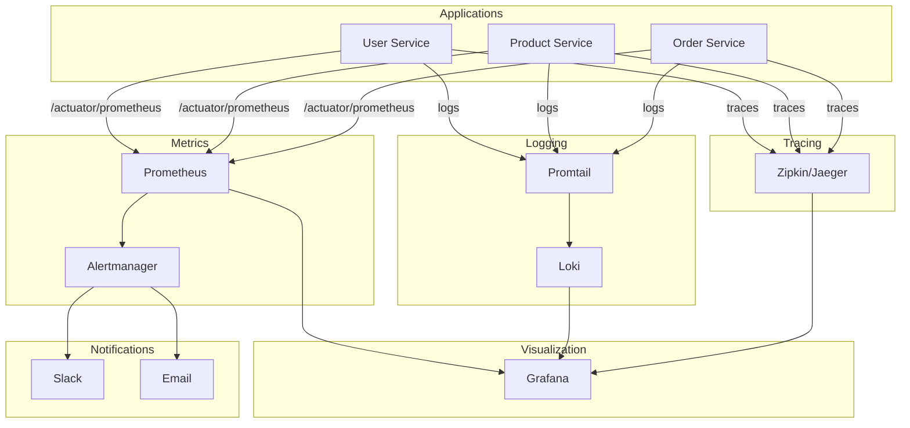

# Phase 5: Observability Stack

**Duration:** Week 7  
**Goal:** Complete monitoring, logging, and tracing infrastructure

---

## 📋 Objectives

| Objective | Status | Priority |
|-----------|--------|----------|
| Deploy Prometheus | ⬜ | P0 |
| Configure Grafana dashboards | ⬜ | P0 |
| Deploy Loki for logging | ⬜ | P1 |
| Configure distributed tracing | ⬜ | P1 |
| Set up Alertmanager | ⬜ | P1 |
| Integrate New Relic (optional) | ⬜ | P2 |

---

## 🏗️ Observability Architecture



---

## 📊 Prometheus Setup

### Helm Installation
```bash
helm repo add prometheus-community https://prometheus-community.github.io/helm-charts
helm repo update

helm upgrade --install prometheus prometheus-community/kube-prometheus-stack \
  --namespace observability \
  --create-namespace \
  --values observability/prometheus/values.yaml
```

### Custom Values
```yaml
# observability/prometheus/values.yaml
prometheus:
  prometheusSpec:
    serviceMonitorSelector: {}
    serviceMonitorNamespaceSelector: {}
    retention: 15d
    storageSpec:
      volumeClaimTemplate:
        spec:
          accessModes: ["ReadWriteOnce"]
          resources:
            requests:
              storage: 10Gi

alertmanager:
  config:
    global:
      slack_api_url: ${SLACK_WEBHOOK_URL}
    route:
      receiver: 'slack-notifications'
      routes:
        - match:
            severity: critical
          receiver: 'slack-critical'
    receivers:
      - name: 'slack-notifications'
        slack_configs:
          - channel: '#cloudforge-alerts'
            send_resolved: true
      - name: 'slack-critical'
        slack_configs:
          - channel: '#cloudforge-critical'
            send_resolved: true
```

### ServiceMonitor
```yaml
# observability/prometheus/servicemonitor.yaml
apiVersion: monitoring.coreos.com/v1
kind: ServiceMonitor
metadata:
  name: cloudforge-services
  namespace: observability
spec:
  selector:
    matchLabels:
      app.kubernetes.io/part-of: cloudforge
  namespaceSelector:
    matchNames:
      - cloudforge
  endpoints:
    - port: http
      path: /actuator/prometheus
      interval: 15s
```

---

## 📈 Grafana Dashboards

### Microservices Dashboard
```json
{
  "title": "CloudForge Microservices",
  "panels": [
    {
      "title": "Request Rate",
      "type": "graph",
      "targets": [{
        "expr": "rate(http_server_requests_seconds_count[5m])",
        "legendFormat": "{{service}}"
      }]
    },
    {
      "title": "Error Rate",
      "type": "stat",
      "targets": [{
        "expr": "sum(rate(http_server_requests_seconds_count{status=~\"5..\"}[5m])) / sum(rate(http_server_requests_seconds_count[5m])) * 100"
      }]
    },
    {
      "title": "P99 Latency",
      "type": "graph",
      "targets": [{
        "expr": "histogram_quantile(0.99, rate(http_server_requests_seconds_bucket[5m]))",
        "legendFormat": "{{service}}"
      }]
    },
    {
      "title": "JVM Memory",
      "type": "graph",
      "targets": [{
        "expr": "jvm_memory_used_bytes",
        "legendFormat": "{{service}} - {{area}}"
      }]
    }
  ]
}
```

### Key Metrics to Monitor
| Metric | Query | Alert Threshold |
|--------|-------|-----------------|
| Request Rate | `rate(http_server_requests_seconds_count[5m])` | - |
| Error Rate | `rate(http_server_requests_seconds_count{status=~"5.."}[5m])` | > 1% |
| P99 Latency | `histogram_quantile(0.99, ...)` | > 500ms |
| JVM Heap | `jvm_memory_used_bytes{area="heap"}` | > 80% |
| CPU Usage | `process_cpu_usage` | > 80% |
| DB Connections | `hikaricp_connections_active` | > 90% pool |

---

## 📝 Loki Logging

### Installation
```bash
helm upgrade --install loki grafana/loki-stack \
  --namespace observability \
  --values observability/loki/values.yaml
```

### Values
```yaml
# observability/loki/values.yaml
loki:
  persistence:
    enabled: true
    size: 10Gi
  
promtail:
  enabled: true
  config:
    clients:
      - url: http://loki:3100/loki/api/v1/push
    scrape_configs:
      - job_name: kubernetes-pods
        kubernetes_sd_configs:
          - role: pod
        relabel_configs:
          - source_labels: [__meta_kubernetes_pod_label_app]
            target_label: app
          - source_labels: [__meta_kubernetes_namespace]
            target_label: namespace
```

### Log Queries
```logql
# All logs from user-service
{app="user-service"}

# Error logs only
{namespace="cloudforge"} |= "ERROR"

# Specific request tracing
{app="order-service"} |~ "orderId=.*"

# JSON log parsing
{app="user-service"} | json | level="ERROR"
```

---

## 🔍 Distributed Tracing

### Zipkin Installation
```bash
helm upgrade --install zipkin openzipkin/zipkin \
  --namespace observability \
  --set replicaCount=1
```

### Spring Boot Configuration
```yaml
# application.yml for each service
management:
  tracing:
    sampling:
      probability: 1.0
  zipkin:
    tracing:
      endpoint: http://zipkin.observability:9411/api/v2/spans
```

---

## 🚨 Alerting Rules

```yaml
# observability/prometheus/alerts.yaml
apiVersion: monitoring.coreos.com/v1
kind: PrometheusRule
metadata:
  name: cloudforge-alerts
  namespace: observability
spec:
  groups:
    - name: cloudforge
      rules:
        - alert: HighErrorRate
          expr: |
            sum(rate(http_server_requests_seconds_count{status=~"5.."}[5m])) 
            / sum(rate(http_server_requests_seconds_count[5m])) > 0.01
          for: 5m
          labels:
            severity: critical
          annotations:
            summary: "High error rate detected"
            description: "Error rate is {{ $value | humanizePercentage }}"

        - alert: ServiceDown
          expr: up{job=~".*-service"} == 0
          for: 1m
          labels:
            severity: critical
          annotations:
            summary: "Service {{ $labels.job }} is down"

        - alert: HighLatency
          expr: |
            histogram_quantile(0.99, rate(http_server_requests_seconds_bucket[5m])) > 0.5
          for: 5m
          labels:
            severity: warning
          annotations:
            summary: "P99 latency is above 500ms"

        - alert: HighMemoryUsage
          expr: |
            jvm_memory_used_bytes{area="heap"} 
            / jvm_memory_max_bytes{area="heap"} > 0.8
          for: 5m
          labels:
            severity: warning
          annotations:
            summary: "JVM heap usage above 80%"
```

---

## ✅ Phase 5 Checklist

- [ ] Prometheus deployed and scraping
- [ ] Grafana dashboards created
- [ ] Loki collecting logs
- [ ] Promtail configured
- [ ] Zipkin/Jaeger deployed
- [ ] Services sending traces
- [ ] Alert rules configured
- [ ] Slack integration working
- [ ] Documentation updated

---

## 🧪 Verification

```bash
# Port forward Grafana
kubectl port-forward svc/prometheus-grafana 3000:80 -n observability

# Check Prometheus targets
kubectl port-forward svc/prometheus-kube-prometheus-prometheus 9090 -n observability

# View Zipkin traces
kubectl port-forward svc/zipkin 9411 -n observability

# Test alert (high memory simulation)
kubectl exec -it user-service-xxx -- curl localhost:8081/test/memory-stress
```

---

**Next Phase:** [Phase 6 - Security Hardening](phase-6-security.md)
