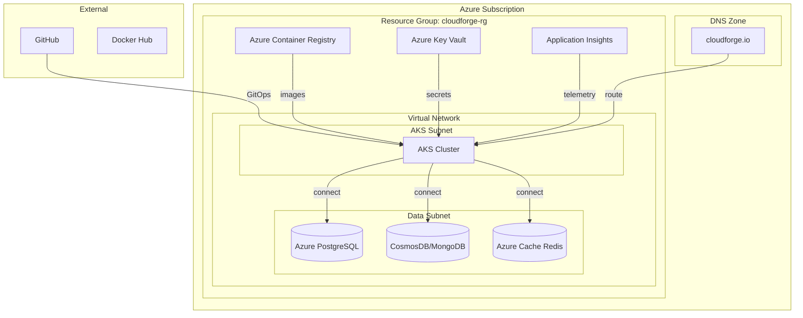

# Phase 7: Azure Deployment

**Duration:** Weeks 9-10  
**Goal:** Production deployment to Azure Kubernetes Service (AKS)

---

## 📋 Objectives

| Objective | Status | Priority |
|-----------|--------|----------|
| Write Terraform for Azure | ⬜ | P0 |
| Provision AKS cluster | ⬜ | P0 |
| Deploy Azure PostgreSQL | ⬜ | P0 |
| Configure ACR or Docker Hub | ⬜ | P1 |
| Deploy via ArgoCD | ⬜ | P0 |
| Configure DNS/Ingress | ⬜ | P1 |
| Enable Azure monitoring | ⬜ | P2 |

---

## 🏗️ Azure Architecture



---

## 📁 Terraform Structure

```
infrastructure/terraform/azure/
├── main.tf              # Main configuration
├── variables.tf         # Input variables
├── outputs.tf           # Output values
├── versions.tf          # Provider versions
├── terraform.tfvars     # Variable values (gitignored)
├── modules/
│   ├── networking/      # VNet, subnets
│   ├── aks/             # AKS cluster
│   ├── database/        # PostgreSQL, Redis
│   └── security/        # Key Vault
└── environments/
    ├── dev.tfvars
    ├── staging.tfvars
    └── prod.tfvars
```

---

## 🔧 Terraform Configuration

### Main Configuration
```hcl
# main.tf
terraform {
  required_version = ">= 1.5.0"
  
  backend "azurerm" {
    resource_group_name  = "cloudforge-terraform"
    storage_account_name = "cloudforgetfstate"
    container_name       = "tfstate"
    key                  = "prod.terraform.tfstate"
  }
}

provider "azurerm" {
  features {}
}

# Resource Group
resource "azurerm_resource_group" "main" {
  name     = "${var.project_name}-rg"
  location = var.location
  
  tags = {
    Environment = var.environment
    Project     = var.project_name
    ManagedBy   = "Terraform"
  }
}

# Networking
module "networking" {
  source = "./modules/networking"
  
  resource_group_name = azurerm_resource_group.main.name
  location            = var.location
  project_name        = var.project_name
  address_space       = var.vnet_address_space
}

# AKS Cluster
module "aks" {
  source = "./modules/aks"
  
  resource_group_name = azurerm_resource_group.main.name
  location            = var.location
  project_name        = var.project_name
  kubernetes_version  = var.kubernetes_version
  node_count          = var.aks_node_count
  node_vm_size        = var.aks_node_vm_size
  subnet_id           = module.networking.aks_subnet_id
}

# Database
module "database" {
  source = "./modules/database"
  
  resource_group_name = azurerm_resource_group.main.name
  location            = var.location
  project_name        = var.project_name
  subnet_id           = module.networking.data_subnet_id
  
  postgres_sku        = var.postgres_sku
  postgres_storage_mb = var.postgres_storage_mb
}

# Key Vault
module "security" {
  source = "./modules/security"
  
  resource_group_name = azurerm_resource_group.main.name
  location            = var.location
  project_name        = var.project_name
  aks_identity_id     = module.aks.kubelet_identity_object_id
}
```

### Variables
```hcl
# variables.tf
variable "project_name" {
  description = "Project name"
  type        = string
  default     = "cloudforge"
}

variable "location" {
  description = "Azure region"
  type        = string
  default     = "East US"
}

variable "environment" {
  description = "Environment name"
  type        = string
  default     = "prod"
}

variable "vnet_address_space" {
  description = "VNet address space"
  type        = list(string)
  default     = ["10.0.0.0/16"]
}

variable "kubernetes_version" {
  description = "AKS Kubernetes version"
  type        = string
  default     = "1.28"
}

variable "aks_node_count" {
  description = "Number of AKS nodes"
  type        = number
  default     = 3
}

variable "aks_node_vm_size" {
  description = "AKS node VM size"
  type        = string
  default     = "Standard_D2s_v3"
}

variable "postgres_sku" {
  description = "PostgreSQL SKU"
  type        = string
  default     = "B_Standard_B1ms"
}

variable "postgres_storage_mb" {
  description = "PostgreSQL storage in MB"
  type        = number
  default     = 32768
}
```

### AKS Module
```hcl
# modules/aks/main.tf
resource "azurerm_kubernetes_cluster" "main" {
  name                = "${var.project_name}-aks"
  location            = var.location
  resource_group_name = var.resource_group_name
  dns_prefix          = var.project_name
  kubernetes_version  = var.kubernetes_version

  default_node_pool {
    name                = "default"
    node_count          = var.node_count
    vm_size             = var.node_vm_size
    vnet_subnet_id      = var.subnet_id
    enable_auto_scaling = true
    min_count           = 2
    max_count           = 5
  }

  identity {
    type = "SystemAssigned"
  }

  network_profile {
    network_plugin    = "azure"
    network_policy    = "calico"
    load_balancer_sku = "standard"
  }

  oms_agent {
    log_analytics_workspace_id = azurerm_log_analytics_workspace.main.id
  }

  key_vault_secrets_provider {
    secret_rotation_enabled = true
  }

  tags = {
    Environment = var.environment
  }
}

resource "azurerm_log_analytics_workspace" "main" {
  name                = "${var.project_name}-logs"
  location            = var.location
  resource_group_name = var.resource_group_name
  sku                 = "PerGB2018"
  retention_in_days   = 30
}
```

### PostgreSQL Module
```hcl
# modules/database/postgres.tf
resource "azurerm_postgresql_flexible_server" "main" {
  name                   = "${var.project_name}-postgres"
  resource_group_name    = var.resource_group_name
  location               = var.location
  version                = "15"
  delegated_subnet_id    = var.subnet_id
  private_dns_zone_id    = azurerm_private_dns_zone.postgres.id
  administrator_login    = "cloudforge_admin"
  administrator_password = random_password.postgres.result
  zone                   = "1"
  storage_mb             = var.postgres_storage_mb
  sku_name               = var.postgres_sku
  backup_retention_days  = 7

  depends_on = [azurerm_private_dns_zone_virtual_network_link.postgres]
}

resource "azurerm_postgresql_flexible_server_database" "users" {
  name      = "users"
  server_id = azurerm_postgresql_flexible_server.main.id
  collation = "en_US.utf8"
  charset   = "utf8"
}

resource "azurerm_postgresql_flexible_server_database" "orders" {
  name      = "orders"
  server_id = azurerm_postgresql_flexible_server.main.id
}

resource "random_password" "postgres" {
  length  = 24
  special = true
}
```

---

## 🚀 Deployment Steps

### 1. Initialize Terraform
```bash
cd infrastructure/terraform/azure

# Login to Azure
az login
az account set --subscription "your-subscription-id"

# Create backend storage
az group create -n cloudforge-terraform -l eastus
az storage account create -n cloudforgetfstate -g cloudforge-terraform
az storage container create -n tfstate --account-name cloudforgetfstate

# Initialize Terraform
terraform init
```

### 2. Plan & Apply
```bash
# Plan
terraform plan -var-file=environments/prod.tfvars -out=tfplan

# Apply
terraform apply tfplan

# Get AKS credentials
az aks get-credentials --resource-group cloudforge-rg --name cloudforge-aks
```

### 3. Deploy ArgoCD to AKS
```bash
kubectl create namespace argocd
kubectl apply -n argocd -f https://raw.githubusercontent.com/argoproj/argo-cd/stable/manifests/install.yaml

# Configure ArgoCD for production
kubectl apply -f argocd/application-prod.yaml
```

### 4. Configure Ingress
```bash
# Install NGINX Ingress Controller
helm upgrade --install ingress-nginx ingress-nginx/ingress-nginx \
  --namespace ingress-nginx \
  --create-namespace \
  --set controller.service.annotations."service\.beta\.kubernetes\.io/azure-load-balancer-health-probe-request-path"=/healthz
```

---

## 📊 Production Values

```yaml
# infrastructure/helm/cloudforge/values-prod.yaml
global:
  environment: production
  imageRegistry: cloudforgeacr.azurecr.io

user-service:
  replicaCount: 3
  resources:
    limits:
      cpu: 1000m
      memory: 1Gi
    requests:
      cpu: 200m
      memory: 512Mi
  env:
    - name: SPRING_PROFILES_ACTIVE
      value: production
    - name: DB_HOST
      value: cloudforge-postgres.postgres.database.azure.com
  
  autoscaling:
    enabled: true
    minReplicas: 2
    maxReplicas: 10
    targetCPUUtilizationPercentage: 70

ingress:
  enabled: true
  className: nginx
  annotations:
    cert-manager.io/cluster-issuer: letsencrypt-prod
  hosts:
    - host: api.cloudforge.io
      paths:
        - path: /api/users
          pathType: Prefix
  tls:
    - secretName: cloudforge-tls
      hosts:
        - api.cloudforge.io
```

---

## ✅ Phase 7 Checklist

- [ ] Terraform modules created
- [ ] Azure infrastructure provisioned
- [ ] AKS cluster running
- [ ] PostgreSQL deployed
- [ ] ACR configured (or Docker Hub)
- [ ] ArgoCD deployed to AKS
- [ ] Production values configured
- [ ] Ingress with TLS
- [ ] DNS configured
- [ ] Azure Monitor enabled
- [ ] Documentation updated

---

## 🧪 Verification

```bash
# Check Azure resources
az group show -n cloudforge-rg

# Verify AKS
kubectl get nodes
kubectl get pods -A

# Test public endpoint
curl https://api.cloudforge.io/api/health

# Check ArgoCD sync
argocd app list
```

---

**Next Phase:** [Phase 8 - Documentation & Showcase](phase-8-documentation.md)
