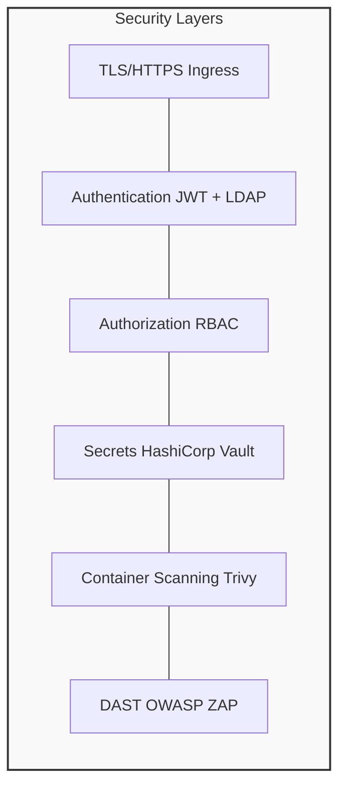
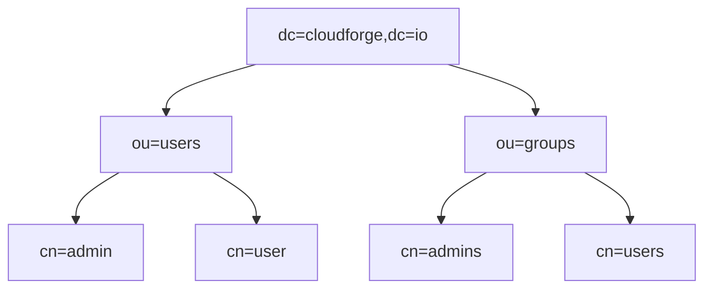

# Security Guide

Security configuration for CloudForge including Vault, LDAP, and security scanning.

---

## 🔐 Security Architecture



---

## 🔑 HashiCorp Vault

### Access Vault UI
- URL: http://localhost:8200
- Token: `dev-token` (development only)

### Store Secrets
```bash
vault kv put secret/cloudforge/database \
  username=cloudforge \
  password=secret123
```

### Read Secrets
```bash
vault kv get secret/cloudforge/database
```

---

## 👤 LDAP Configuration

### Default Users
| Username | Password | Role |
|----------|----------|------|
| admin | admin123 | ADMIN |
| user | user123 | USER |

### LDAP Structure


---

## 🛡️ Security Scanning

### Trivy (Container Scanning)
```bash
# Scan image
trivy image cloudforge/user-service:latest

# CI integration
trivy image --exit-code 1 --severity HIGH,CRITICAL <image>
```

### OWASP ZAP (DAST)
```bash
# Baseline scan
docker run -t owasp/zap2docker-stable zap-baseline.py \
  -t http://localhost:8080
```

---

## ✅ Security Checklist

- [ ] All secrets in Vault
- [ ] TLS enabled
- [ ] JWT tokens validated
- [ ] RBAC configured
- [ ] Container images scanned
- [ ] Dependencies updated
- [ ] Network policies applied

---

## 📚 Next Steps

- [CI/CD Pipeline](ci-cd-pipeline.md) - Security in CI
- [Troubleshooting](troubleshooting.md) - Security issues
