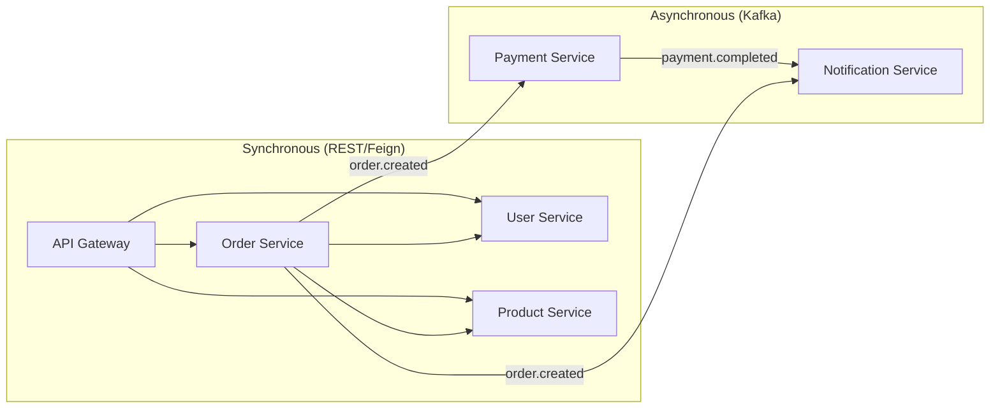

# Service Guides Index

Detailed development guides for each CloudForge microservice.

---

## 🏗️ Microservices Overview

| Service | Port | Database | Key Features |
|---------|------|----------|--------------|
| [User Service](user-service-guide.md) | 8081 | PostgreSQL | LDAP auth, JWT tokens, RBAC |
| [Product Service](product-service-guide.md) | 8082 | MongoDB | Catalog, search, caching |
| [Order Service](order-service-guide.md) | 8083 | PostgreSQL | Cart, saga pattern, Feign |
| [Payment Service](payment-service-guide.md) | 8084 | PostgreSQL | Stripe, idempotency |
| [Notification Service](notification-service-guide.md) | 8085 | PostgreSQL | Email, templates, async |

---

## 🔄 Service Communication



---

## 📋 Development Checklist

For each service:
- [ ] Read the service guide
- [ ] Set up local dependencies (Docker)
- [ ] Configure `application-dev.yml`
- [ ] Run database migrations
- [ ] Start the service
- [ ] Test health endpoint
- [ ] Explore Swagger UI

---

## 🚀 Quick Start All Services

```bash
# 1. Start infrastructure
docker-compose up -d

# 2. Start services (in separate terminals)
cd services/user-service && ./mvnw spring-boot:run
cd services/product-service && ./mvnw spring-boot:run
cd services/order-service && ./mvnw spring-boot:run
cd services/payment-service && ./mvnw spring-boot:run
cd services/notification-service && ./mvnw spring-boot:run
```

---

## 📚 Related Docs

- [Java Development Guide](../java-development.md)
- [Architecture](../architecture.md)
- [API Reference](../api-reference.md)
