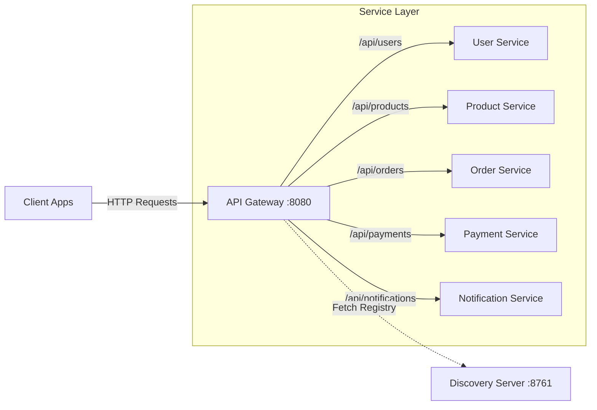

# API Gateway

The API Gateway is the single entry point for all client requests in the CloudForge ecosystem. Built on **Spring Cloud Gateway**, it handles routing, load balancing, and cross-cutting concerns like CORS and security headers. It integrates seamlessly with the Discovery Server to dynamically route traffic to registered microservices.

## Architecture

Traffic flows from the client (Frontend/Mobile) to the API Gateway, which then uses the Service Discovery registry to forward the request to the appropriate microservice instance.



## Features

- **Dynamic Routing**: Uses Eureka Service Discovery to resolve service locations.
- **Path Rewriting**: Automatically strips prefixes (e.g., `/api/users/` -> `/`) before forwarding.
- **CORS Configuration**: Centralized Cross-Origin Resource Sharing settings for frontend integration.
- **Actuator Endpoints**: Health and metrics monitoring.

## Route Configuration

The Gateway is configured to route traffic based on URL paths.

| Path Pattern | Target Service | Description |
|--------------|----------------|-------------|
| `/api/auth/**` | `user-service` | Authentication endpoints |
| `/api/users/**` | `user-service` | User profile management |
| `/api/products/**` | `product-service` | Product catalog operations |
| `/api/orders/**` | `order-service` | Order processing |
| `/api/cart/**` | `order-service` | Shopping cart management |
| `/api/payments/**` | `payment-service` | Payment processing |
| `/api/payments/**` | `payment-service` | Payment processing |
| `/api/notifications/**` | `notification-service` | Notification preferences and history |
| `/swagger-ui.html` | `swagger-aggregator` | Unified API Documentation |
| `/v3/api-docs/**` | `swagger-aggregator` | Proxied API Definitions |

## Configuration Details

The routes are defined in `application.yml`:

```yaml
spring:
  cloud:
    gateway:
      routes:
        - id: user-service-auth
          uri: lb://user-service
          predicates:
            - Path=/api/auth/**
          filters:
            - RewritePath=/api/auth/(?<segment>.*), /api/auth/${segment}
```

- **id**: Unique identifier for the route.
- **uri**: `lb://SERVICE-NAME` tells Spring Cloud Gateway to load balance requests using the service name registered in Eureka.
- **predicates**: Conditions that must match (e.g., URL path).
- **filters**: Modifications to the request (e.g., rewriting the path).
