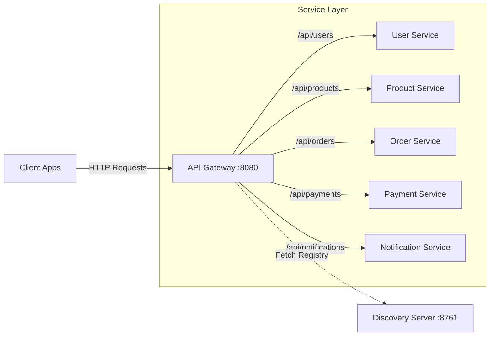

# API Gateway

The API Gateway is the single entry point for all client requests in the CloudForge ecosystem. Built on **Spring Cloud Gateway**, it handles routing, load balancing, and cross-cutting concerns like CORS and security headers. It integrates seamlessly with the Discovery Server to dynamically route traffic to registered microservices.

## Architecture

Traffic flows from the client (Frontend/Mobile) to the API Gateway, which then uses the Service Discovery registry to forward the request to the appropriate microservice instance.


```mermaid
graph LR
    Client[Client Apps] -->|HTTP Requests| Gateway[API Gateway :8080]
    
    subgraph Service Layer
        Gateway -->|/api/users| UserService[User Service]
        Gateway -->|/api/products| ProductService[Product Service]
        Gateway -->|/api/orders| OrderService[Order Service]
        Gateway -->|/api/payments| PaymentService[Payment Service]
        Gateway -->|/api/notifications| NotificationService[Notification Service]
    end
    
    Gateway -.->|Fetch Registry| Eureka[Discovery Server :8761]
```

## Features

- **Dynamic Routing**: Uses Eureka Service Discovery to resolve service locations.
- **JWT Authentication**: Validates JWT tokens and adds user context headers.
- **Path Rewriting**: Automatically strips prefixes (e.g., `/api/users/` -> `/`) before forwarding.
- **CORS Configuration**: Centralized Cross-Origin Resource Sharing settings for frontend integration.
- **Error Handling**: Consistent error response format across all services.
- **Actuator Endpoints**: Health and metrics monitoring.

## JWT Authentication

The API Gateway implements centralized JWT authentication for all protected endpoints.

### Authentication Flow

1. **Client Request**: Client includes JWT token in Authorization header
2. **Token Validation**: Gateway validates token signature and expiration
3. **User ID Extraction**: Gateway extracts user ID from token claims
4. **Header Injection**: Gateway adds `X-User-Id` header to request
5. **Request Forwarding**: Gateway forwards authenticated request to downstream service

### JWT Filter

The `JwtAuthenticationFilter` runs with order `-100` (before other filters) and:
- Validates JWT token from Authorization header
- Extracts user ID from token claims
- Adds `X-User-Id` header for downstream services
- Returns 401 for invalid/expired tokens

### Public Endpoints

The following endpoints bypass authentication:
- `/api/auth/**` - Login and registration
- `/api/products/**` - Product browsing
- `/swagger-ui/**` - API documentation
- `/v3/api-docs/**` - OpenAPI specs
- `/actuator/**` - Health checks

### Configuration

```yaml
jwt:
  secret: ${JWT_SECRET:your-secret-key-at-least-256-bits-long}
  expiration: 86400000  # 24 hours
```

**Environment Variables:**
- `JWT_SECRET`: Shared secret for JWT validation (must match user-service)
- `JWT_EXPIRATION`: Token expiration time in milliseconds

### Error Responses

**401 Unauthorized - Missing Token:**
```json
{
  "error": "Unauthorized",
  "message": "Missing or invalid authentication token",
  "status": 401,
  "path": "/api/orders",
  "timestamp": "2026-04-19T10:30:00Z"
}
```

**401 Unauthorized - Invalid/Expired Token:**
```json
{
  "error": "Unauthorized",
  "message": "Invalid or expired authentication token",
  "status": 401,
  "path": "/api/orders",
  "timestamp": "2026-04-19T10:30:00Z"
}
```

For detailed authentication documentation, see [Authentication Guide](../api/authentication.md).

## Route Configuration

The Gateway is configured to route traffic based on URL paths.

| Path Pattern | Target Service | Description |
|--------------|----------------|-------------|
| `/api/auth/**` | `user-service` | Authentication endpoints |
| `/api/users/**` | `user-service` | User profile management |
| `/api/products/**` | `product-service` | Product catalog operations |
| `/api/orders/**` | `order-service` | Order processing |
| `/api/cart/**` | `order-service` | Shopping cart management |
| `/api/payments/**` | `payment-service` | Payment processing |
| `/api/payments/**` | `payment-service` | Payment processing |
| `/api/notifications/**` | `notification-service` | Notification preferences and history |
| `/swagger-ui.html` | `swagger-aggregator` | Unified API Documentation |
| `/v3/api-docs/**` | `swagger-aggregator` | Proxied API Definitions |

## Configuration Details

The routes are defined in `application.yml`:

```yaml
spring:
  cloud:
    gateway:
      routes:
        - id: user-service-auth
          uri: lb://user-service
          predicates:
            - Path=/api/auth/**
          filters:
            - RewritePath=/api/auth/(?<segment>.*), /api/auth/${segment}
```

- **id**: Unique identifier for the route.
- **uri**: `lb://SERVICE-NAME` tells Spring Cloud Gateway to load balance requests using the service name registered in Eureka.
- **predicates**: Conditions that must match (e.g., URL path).
- **filters**: Modifications to the request (e.g., rewriting the path).
