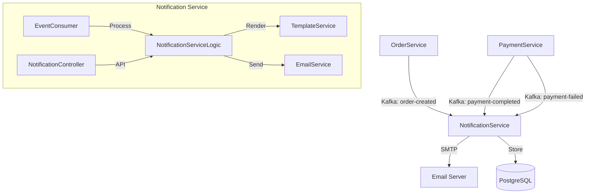
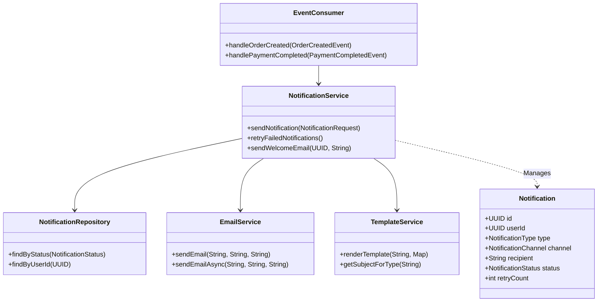
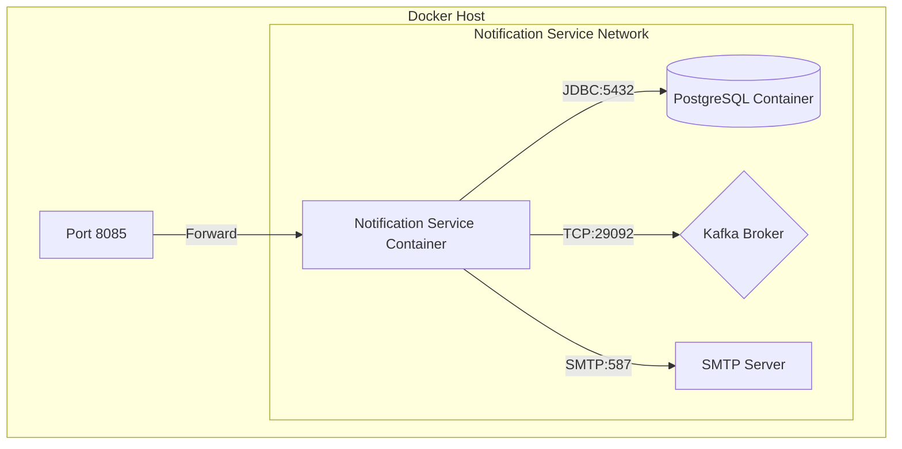
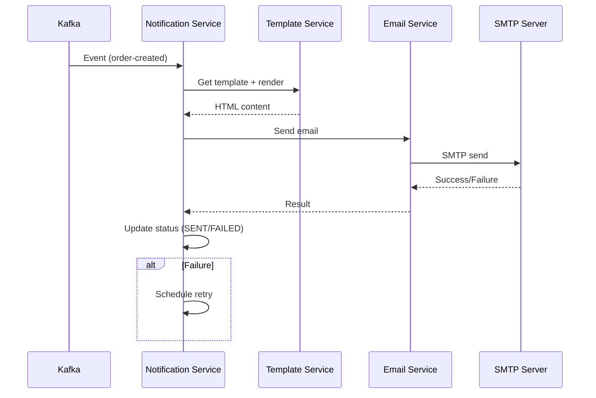
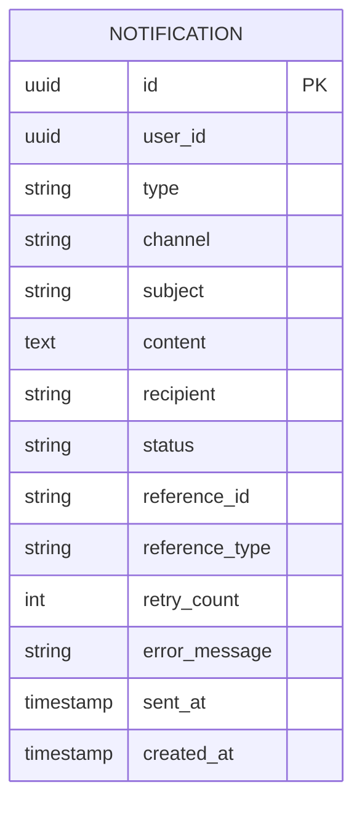

## Overview

The Notification Service handles multi-channel notifications (Email, SMS, Push) with templated content, retry logic, and event-driven architecture.

<CardGroup cols={2}>
  <Card title="Port 8085" icon="server">
    Runs on port 8085 by default
  </Card>
  <Card title="PostgreSQL" icon="database">
    Uses `cloudforge_notifications` database
  </Card>
  <Card title="SMTP" icon="envelope">
    Email via JavaMail + Thymeleaf
  </Card>
  <Card title="Kafka" icon="tower-broadcast">
    Event-driven notifications
  </Card>
</CardGroup>

## Architecture

The Notification Service consumes events from Order and Payment services to send notifications.



## Class Diagram



## Deployment



## Notification Flow



## Database Schema



## Email Templates

| Template | Type | Description |
| :--- | :--- | :--- |
| `order-confirmation` | ORDER_CONFIRMATION | Order placed successfully |
| `payment-success` | PAYMENT_SUCCESS | Payment completed |
| `payment-failed` | PAYMENT_FAILED | Payment failed with retry link |
| `welcome` | WELCOME | New user registration |

## API Reference

| Method | Endpoint | Description |
| :--- | :--- | :--- |
| `POST` | `/api/notifications` | Send notification |
| `GET` | `/api/notifications/{id}` | Get notification by ID |
| `GET` | `/api/notifications/user/{userId}` | Get user's notifications |
| `POST` | `/api/notifications/welcome` | Send welcome email (test) |

## Configuration

```yaml
server:
  port: 8085

spring:
  mail:
    host: smtp.gmail.com
    port: 587
    username: ${MAIL_USERNAME}
    password: ${MAIL_PASSWORD}

notification:
  from-email: noreply@cloudforgetech.in
  from-name: CloudForge
  retry-attempts: 3
```

## Development

```bash
cd services/notification-service
mvn spring-boot:run

# Swagger UI
http://localhost:8085/swagger-ui.html
```
