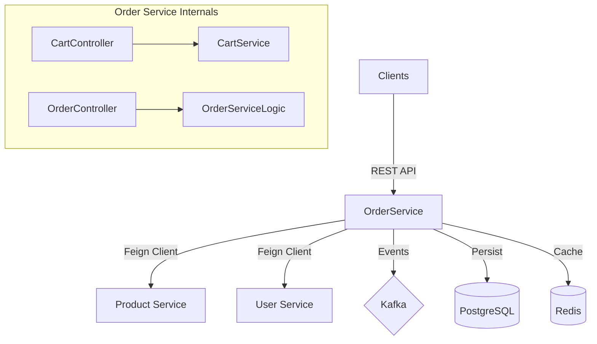
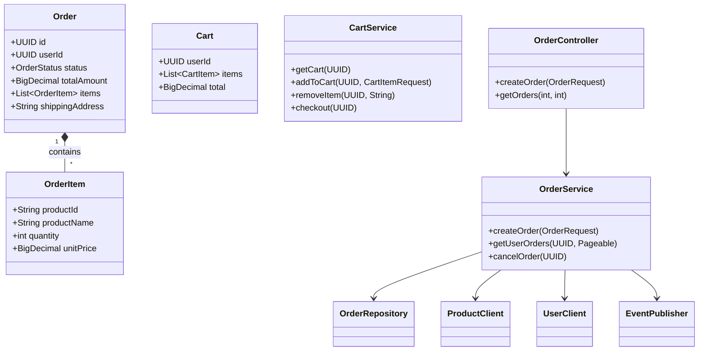
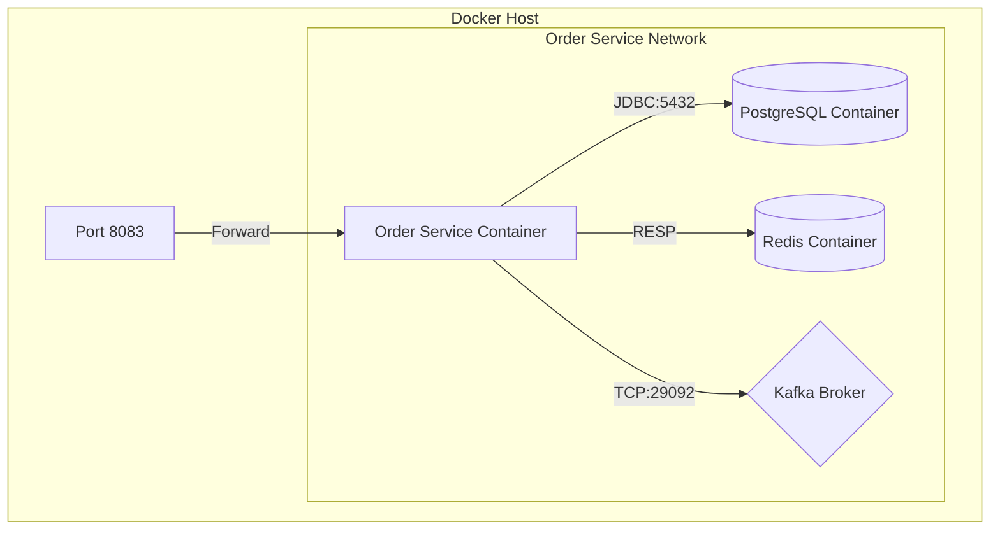
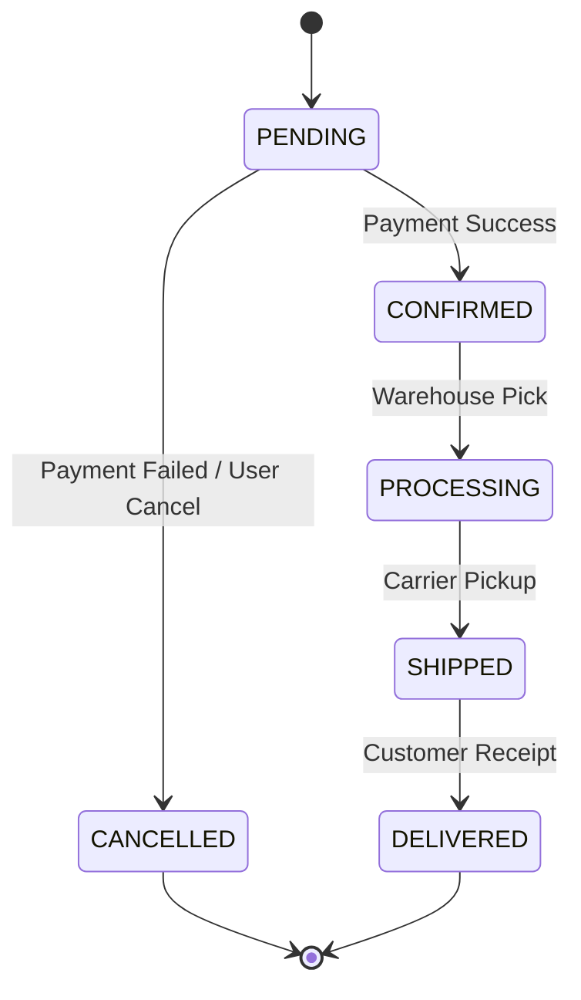
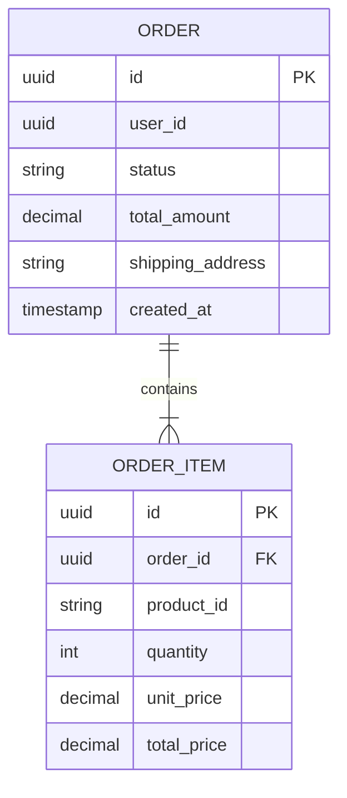

## Overview

The Order Service handles the core e-commerce functionality of placing, tracking, and managing orders. It integrates with the Product Service for inventory checks and the User Service for customer validation.

<CardGroup cols={2}>
  <Card title="Port 8083" icon="server">
    Runs on port 8083 by default
  </Card>
  <Card title="PostgreSQL" icon="database">
    Uses `cloudforge_orders` database
  </Card>
  <Card title="Kafka" icon="tower-broadcast">
    Publishes order events
  </Card>
  <Card title="Redis" icon="layer-group">
    Caches cart data
  </Card>
</CardGroup>

## Architecture

The Order Service sits at the center of the checkout flow, orchestrating interactions between the user, inventory, and payment systems (planned).



## Class Diagram



## Deployment



## Order Status Flow

Orders transition through specific states during their lifecycle.



## Database Schema

The service uses a relational schema to manage orders and line items.



## API Reference

### Cart Management

| Method | Endpoint | Description |
| :--- | :--- | :--- |
| `GET` | `/api/cart` | Retrieve current user's cart |
| `POST` | `/api/cart/items` | Add item to cart |
| `PUT` | `/api/cart/items/{productId}` | Update item quantity |
| `DELETE` | `/api/cart/items/{productId}` | Remove item from cart |
| `POST` | `/api/cart/checkout` | Convert cart to order |

### Order Management

| Method | Endpoint | Description |
| :--- | :--- | :--- |
| `POST` | `/api/orders` | Create a new order directy |
| `GET` | `/api/orders` | List user's orders |
| `GET` | `/api/orders/{id}` | Get order details |
| `PUT` | `/api/orders/{id}/cancel` | Cancel an order |

## Configuration

The service is configured via `application.yml`. Key settings include:

```yaml
server:
  port: 8083

spring:
  datasource:
    url: jdbc:postgresql://postgres:5432/cloudforge_orders
  kafka:
    bootstrap-servers: kafka:29092
  data:
    redis:
      host: redis
      port: 6379
```

## Development

To run the service locally:

```bash
cd services/order-service
mvn spring-boot:run
```

Ensure infrastructure is up:

```bash
docker-compose up -d postgres redis kafka zookeeper
```
