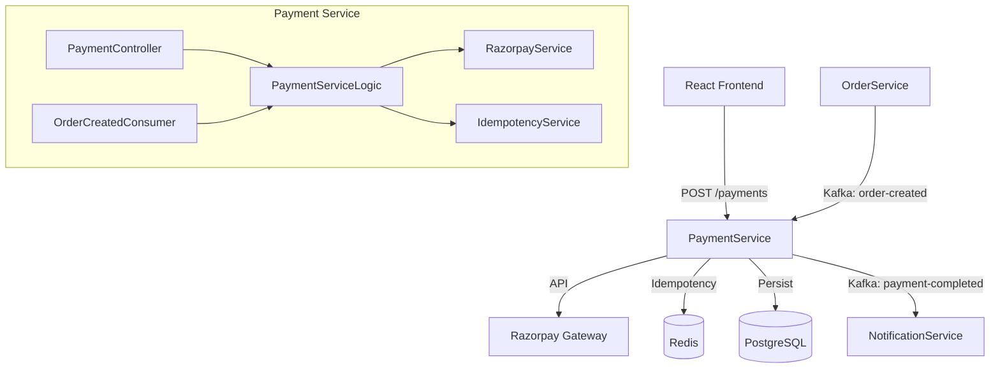
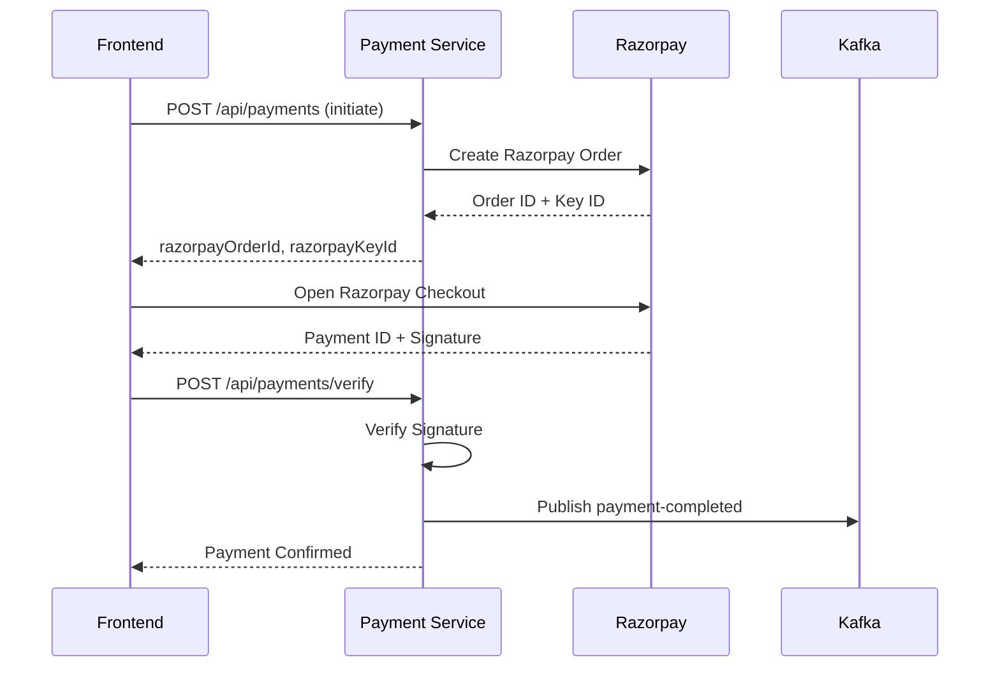
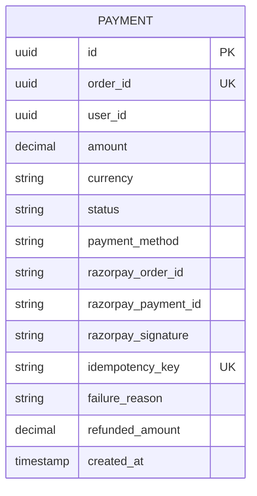

## Overview

The Payment Service handles payment processing for orders using Razorpay as the payment gateway. It provides idempotent payment handling, refund processing, and event-driven communication.

<CardGroup cols={2}>
  <Card title="Port 8084" icon="server">
    Runs on port 8084 by default
  </Card>
  <Card title="PostgreSQL" icon="database">
    Uses `cloudforge_payments` database
  </Card>
  <Card title="Razorpay" icon="credit-card">
    Payment gateway integration
  </Card>
  <Card title="Redis" icon="layer-group">
    Idempotency key storage
  </Card>
</CardGroup>

## Architecture

The Payment Service consumes order events and processes payments through Razorpay.



## Payment Flow

The payment process involves frontend integration with Razorpay checkout.



## Database Schema



## API Reference

| Method | Endpoint | Description |
| :--- | :--- | :--- |
| `POST` | `/api/payments` | Initiate payment (create Razorpay order) |
| `POST` | `/api/payments/verify` | Verify payment after checkout |
| `GET` | `/api/payments/{id}` | Get payment by ID |
| `GET` | `/api/payments/order/{orderId}` | Get payment by order |
| `POST` | `/api/payments/{id}/refund` | Process refund |

## Configuration

```yaml
server:
  port: 8084

razorpay:
  key-id: ${RAZORPAY_KEY_ID}
  key-secret: ${RAZORPAY_KEY_SECRET}

spring:
  kafka:
    consumer:
      group-id: payment-service
```

## Development

```bash
cd services/payment-service
mvn spring-boot:run

# Swagger UI
http://localhost:8084/swagger-ui.html
```
