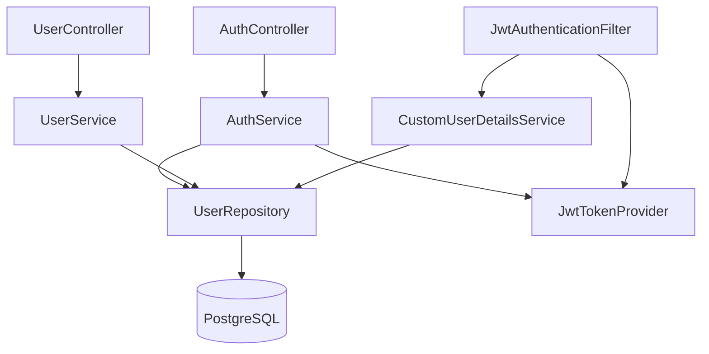
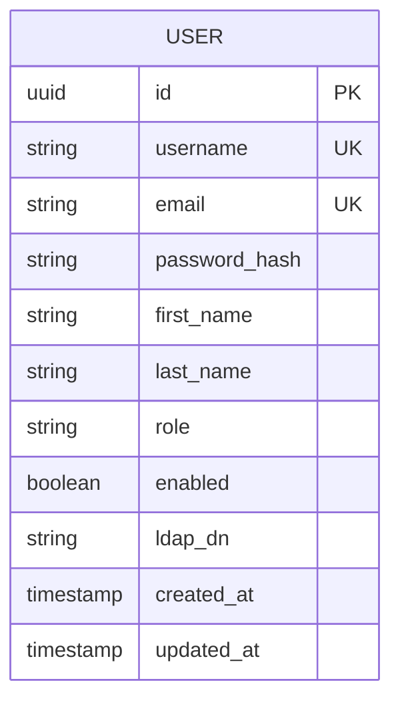

# User Service

The User Service is the backbone of identity and access management in CloudForge. It handles user registration, authentication via JWT, and profile management.

## Architecture



## Configuration

The service is configured via `application.yml`:

```yaml
server:
  port: 8081

spring:
  datasource:
    url: jdbc:postgresql://localhost:5432/cloudforge
    username: cf_user
    password: cf_password
  jpa:
    hibernate:
      ddl-auto: validate
  flyway:
    enabled: true

jwt:
  secret: your-256-bit-secret-key-here
  expiration: 86400000 # 24 hours in milliseconds
```

## API Endpoints

### Authentication (`/api/auth`)

#### POST `/api/auth/login`
Authenticate a user and receive a JWT token.

**Request Body:**
```json
{
  "username": "admin",
  "password": "admin123"
}
```

**Response (200 OK):**
```json
{
  "token": "eyJhbGciOiJI...",
  "type": "Bearer",
  "user": {
    "id": "uuid",
    "username": "admin",
    "email": "admin@cloudforge.io",
    "role": "ADMIN"
  }
}
```

#### POST `/api/auth/register`
Register a new user account.

**Request Body:**
```json
{
  "username": "newuser",
  "email": "user@example.com",
  "password": "securePassword123",
  "firstName": "John",
  "lastName": "Doe"
}
```

### User Management (`/api/users`)

<Note>All `/api/users` endpoints require a valid JWT token in the `Authorization` header.</Note>

#### GET `/api/users/me`
Get the currently authenticated user's profile.

#### PUT `/api/users/me`
Update the current user's profile (firstName, lastName, email).

#### GET `/api/users` (Admin Only)
List all users in the system.

#### DELETE `/api/users/{id}` (Admin Only)
Delete a user by ID.

## Security Components

| Component | Purpose |
| :--- | :--- |
| `SecurityConfig` | Configures Spring Security, CORS, session management, endpoint authorization |
| `JwtTokenProvider` | Generates and validates JWT tokens using HMAC-SHA256 |
| `JwtAuthenticationFilter` | Intercepts requests, extracts tokens, sets SecurityContext |
| `CustomUserDetailsService` | Loads user details from DB for authentication |

## Database Schema

The `User` entity is persisted via JPA with Flyway migrations.



| Column | Type | Constraints | Description |
| :--- | :--- | :--- | :--- |
| `id` | UUID | PK | Auto-generated UUID |
| `username` | VARCHAR(50) | UNIQUE, NOT NULL | Login username |
| `email` | VARCHAR(100) | UNIQUE, NOT NULL | User email |
| `password_hash` | VARCHAR(255) | | BCrypt encoded password |
| `first_name` | VARCHAR(50) | | User's first name |
| `last_name` | VARCHAR(50) | | User's last name |
| `role` | VARCHAR(20) | NOT NULL | USER or ADMIN |
| `enabled` | BOOLEAN | DEFAULT true | Account status |
| `ldap_dn` | VARCHAR(255) | | LDAP Distinguished Name (optional) |
| `created_at` | TIMESTAMP | | Record creation time |
| `updated_at` | TIMESTAMP | | Last update time |

## DTOs

- **LoginRequest**: `username`, `password`
- **RegisterRequest**: `username`, `email`, `password`, `firstName`, `lastName`
- **LoginResponse**: `token`, `type`, `user`
- **UserDTO**: `id`, `username`, `email`, `firstName`, `lastName`, `role`, `enabled`, `createdAt`
